# Building the Linux Kernel on macOS with Bazel

**Cross-Compilation Challenges, Sandbox Differences, and Hermetic Solutions**

Building the Linux kernel on macOS presents unique challenges that don't exist on Linux hosts. This post documents the issues we encountered and the solutions that made it work with Bazel's hermetic build system.

---

## Why Build Linux on macOS?

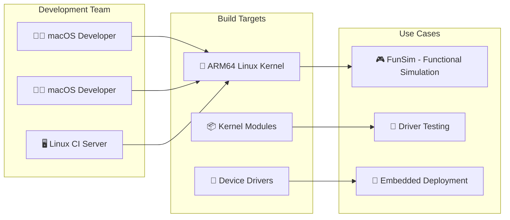

For teams developing embedded systems, kernel drivers, or simulation environments, developers on macOS need to build ARM64/x86_64 Linux kernels without switching to Linux workstations.

---

## Issue 1: Case-Sensitive Filesystem

### The Problem

macOS uses a **case-insensitive** filesystem by default. The Linux kernel contains files that differ only by case:

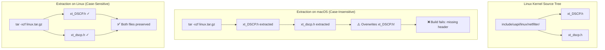

### Solutions

**Option A: Case-Sensitive APFS Volume**

```bash
# Create a dedicated case-sensitive volume
diskutil apfs addVolume /dev/disk3 "Case-sensitive APFS" linux

cd /Volumes/linux
tar -xzf linux-6.x.tar.gz
```

**Option B: Bazel's Sandbox**

Bazel's sandbox preserves case because it symlinks to original paths rather than copying:

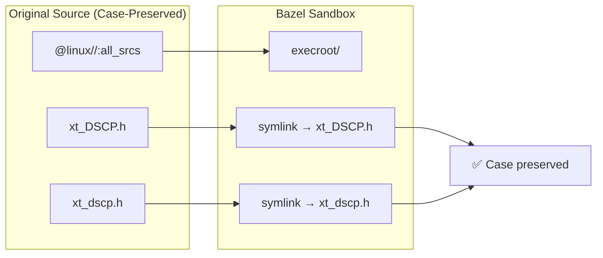

---

## Issue 2: Missing System Headers

### The Problem

Linux kernel build tools expect headers that don't exist on macOS:

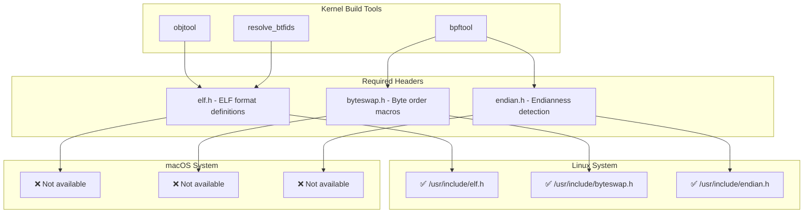

### Solution: bee-headers

The [bee-headers](https://github.com/bee-headers/headers) project provides BSD-licensed implementations:

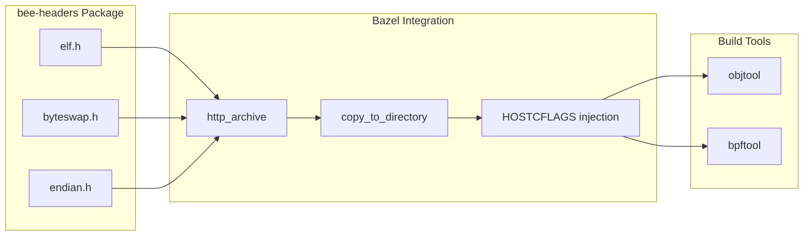

**Implementation:**

```python
# MODULE.bazel
http_archive(
    name = "bee_headers",
    build_file = "//:third_party/bee_headers.BUILD",
    url = "https://github.com/bee-headers/headers/archive/<commit>.tar.gz",
)
```

```python
# Inject via HOSTCFLAGS
env = select({
    "//:aarch64_macos": {
        "HOSTCFLAGS": "-I$$EXT_BUILD_ROOT/$(location @bee_headers)",
    },
    "//conditions:default": {},
})
```

---

## Issue 3: GNU vs BSD Tool Incompatibilities

### The Problem

Linux kernel Makefiles assume GNU tools. macOS ships BSD variants with different syntax:

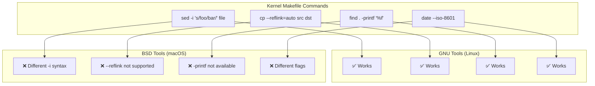

### Solution: Hermetic GNU Toolchains

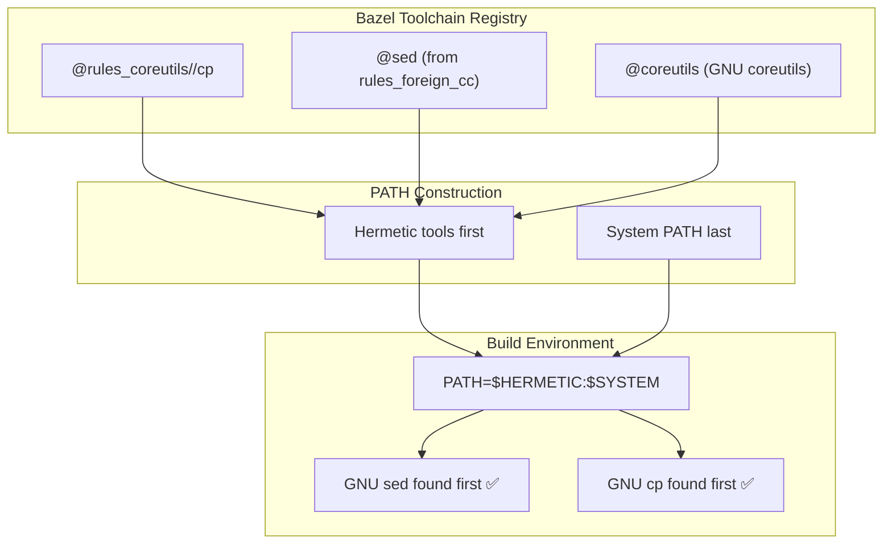

**Implementation:**

```python
PATH_MACOS_PATHS = [
    "$$(dirname $$EXT_BUILD_ROOT/$(location @sed))",
]

env = {
    "PATH": ":".join(PATH_COMMON_PATHS + PATH_MACOS_PATHS + ["$$PATH"]),
}
```

---

## Issue 4: Darwin Sandbox Symlink Resolution (The BPF Problem)

### The Problem

This was the most subtle issue. The kernel's BPF build uses relative paths that break on macOS:

```mermaid
flowchart TD
    subgraph "Source Tree Structure"
        A["linux/"]
        A --> B["kernel/bpf/Makefile"]
        A --> C["tools/scripts/Makefile.include"]
        B -->|"include ../tools/..."| C
    end

    subgraph "Linux Sandbox Behavior"
        D["execroot/linux/"]
        D --> E["kernel/bpf/ (directory)"]
        D --> F["tools/ (directory)"]
        E -->|"../tools/"| F
        F --> G["✅ Resolves correctly"]
    end

    subgraph "macOS Sandbox Behavior"
        H["execroot/"]
        H --> I["kernel/bpf/ → symlink"]
        I -->|"points to"| J["/original/source/kernel/bpf/"]
        J -->|"../tools/"| K["/original/source/tools/"]
        K -->|"NOT in sandbox"| L["❌ File not found"]
    end
```

### Detailed Breakdown

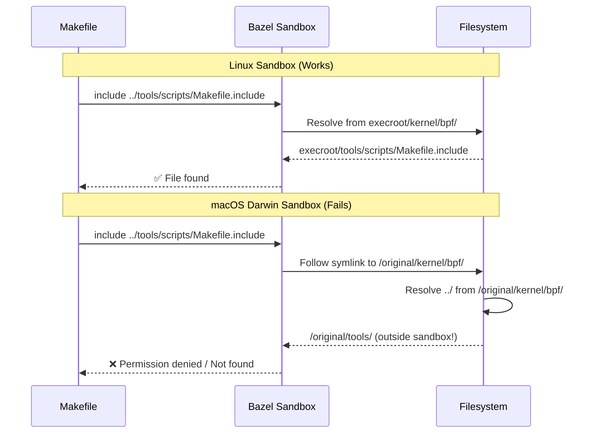

### Solution: Disable BPF via Patch

Since BPF isn't needed for our use case (kernel modules, simulation), we disable it:

```diff
# 01-macos.patch - Rename Build file to disable BPF
diff --git a/tools/lib/bpf/Build b/tools/lib/bpf/_Build
rename from tools/lib/bpf/Build
rename to tools/lib/bpf/_Build
```

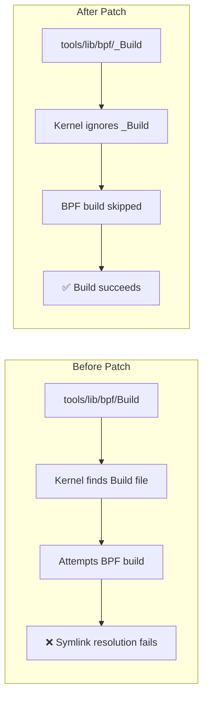

---

## Issue 5: libelf and elfutils

### The Problem

The kernel's `objtool` requires `libelf`. On Linux, this comes from `elfutils`, but it doesn't build on macOS:

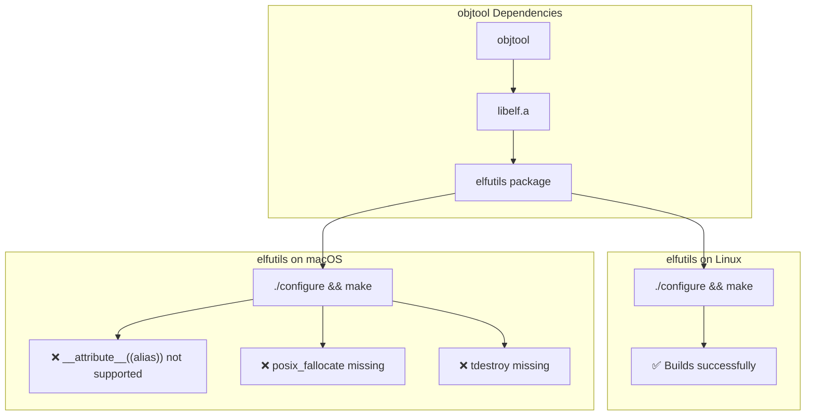

### Solution: Platform-Conditional Dependencies

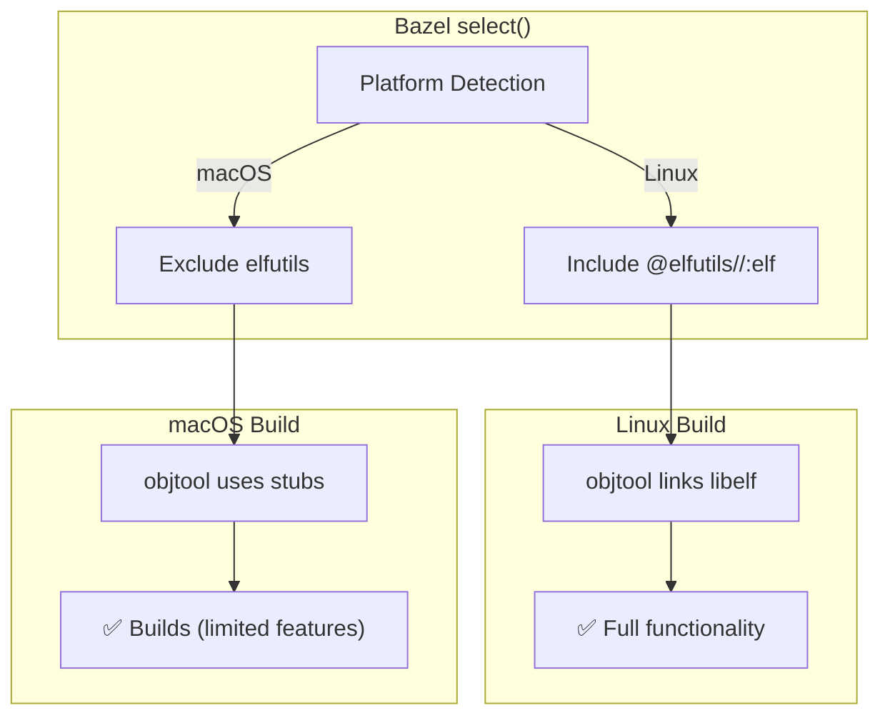

```python
# Platform-conditional dependencies
_PKG_CONFIG_DEPS = COMMON_DEPS + select({
    "//:aarch64_macos": [],  # Skip elfutils
    "//conditions:default": ["@elfutils//:elf"],
})
```

---

## Complete Build Architecture

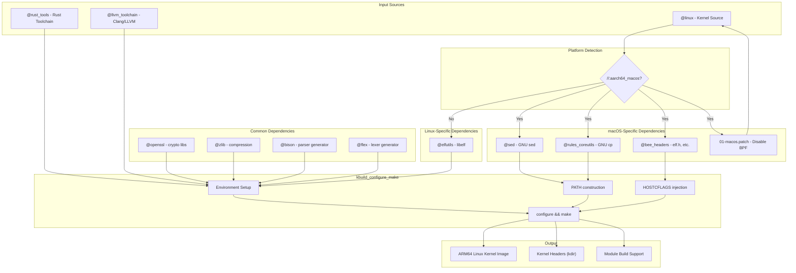

---

## Build Flow Timeline

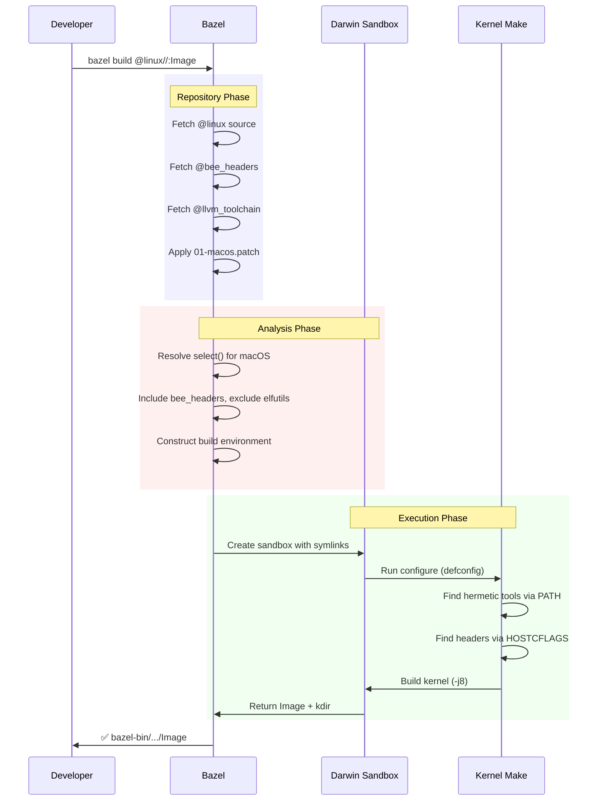

---

## Key Takeaways

```mermaid
mindmap
  root((Linux on macOS))
    Case Sensitivity
      Bazel sandbox handles it
      Manual builds need APFS volume
    Missing Headers
      bee-headers provides elf.h
      Inject via HOSTCFLAGS
    GNU vs BSD Tools
      Hermetic toolchains
      PATH prepending
    Sandbox Symlinks
      Darwin resolves differently
      Patch problematic paths
    Conditional Deps
      select() per platform
      Skip elfutils on macOS
```

---

## Quick Reference: Manual Build Prerequisites

```bash
# Install GNU tools
brew install coreutils findutils gnu-sed gnu-tar grep llvm lld make pkg-config

# Install Linux headers for macOS
brew tap bee-headers/bee-headers
brew install bee-headers/bee-headers/bee-headers
source bee-init

# Create case-sensitive volume
diskutil apfs addVolume /dev/disk3 "Case-sensitive APFS" linux

# Build
cd /Volumes/linux
curl -L https://github.com/torvalds/linux/archive/v6.x.tar.gz | tar -xz
cd linux-6.x
make LLVM=1 defconfig
make LLVM=1 -j$(sysctl -n hw.physicalcpu)
```

---

## References

- [bee-headers project](https://github.com/bee-headers/headers) - BSD-licensed Linux headers for macOS
- [Linux kernel BPF path fix](https://github.com/torvalds/linux/commit/150a27328b681425c8cab239894a48f2aeb870e9)
- [Building kernel tools from source tree](https://stackoverflow.com/questions/57286857/how-to-compile-tool-and-samples-from-within-the-kernel-source-tree)
- [rules_foreign_cc](https://github.com/bazelbuild/rules_foreign_cc) - Bazel rules for building non-Bazel projects
- [Rust for Linux](https://github.com/Rust-for-Linux/linux) - Linux kernel with Rust support

---

*Published: January 2026*
