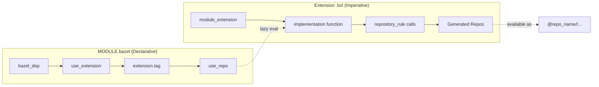
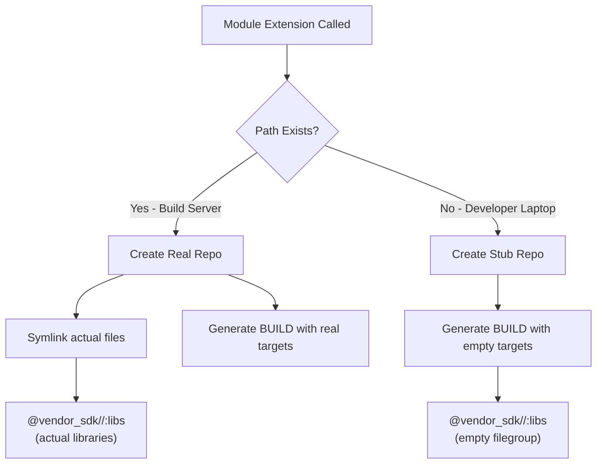
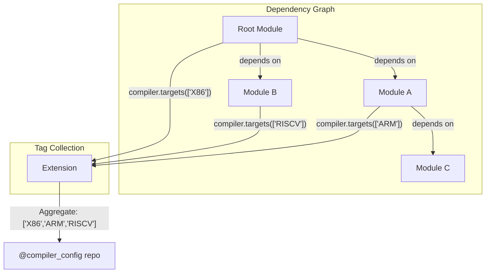
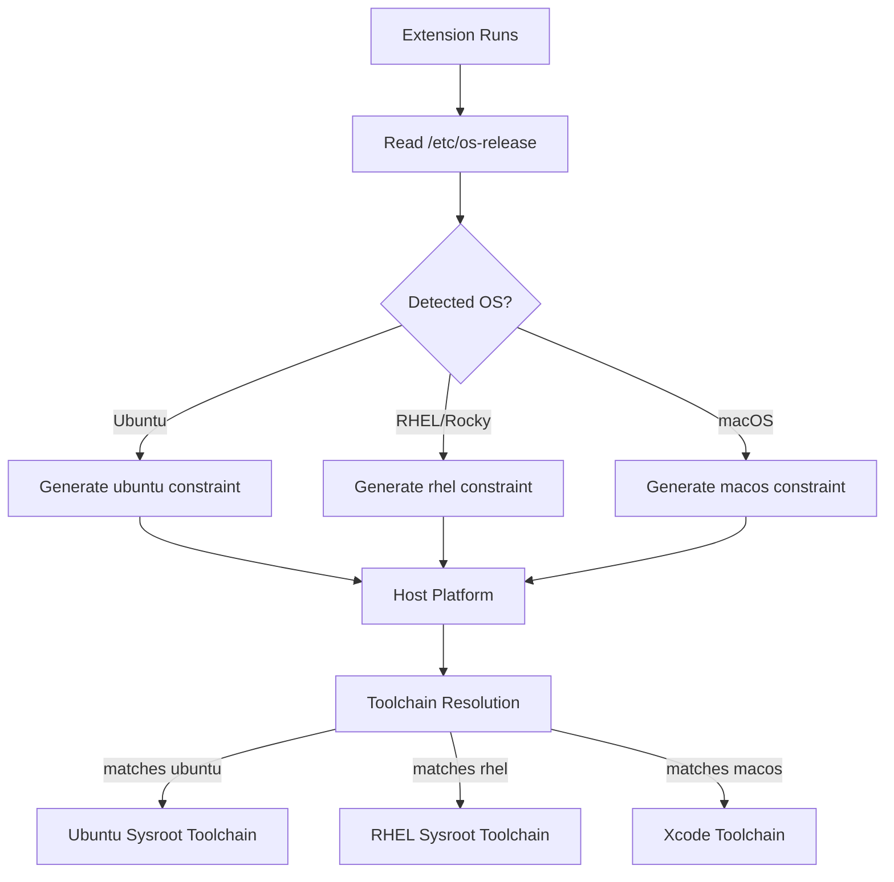
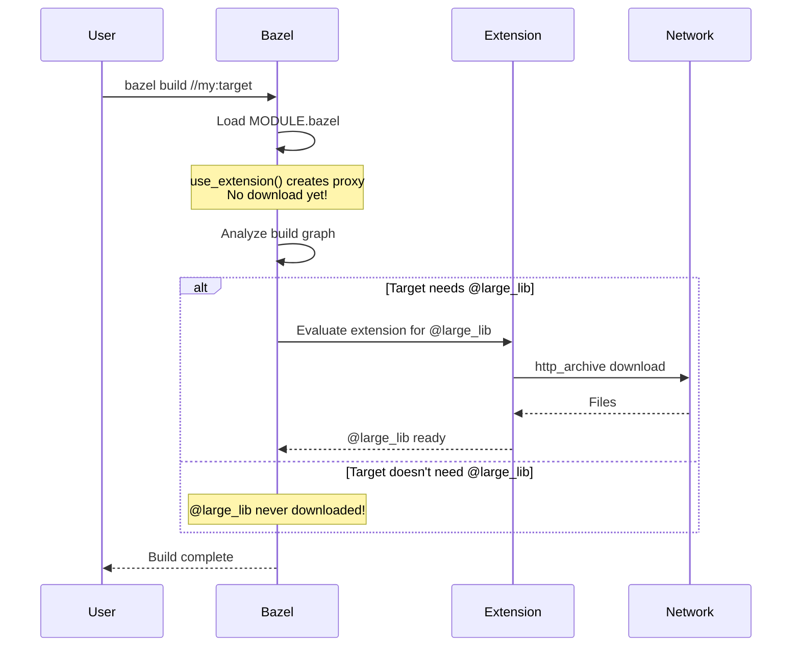
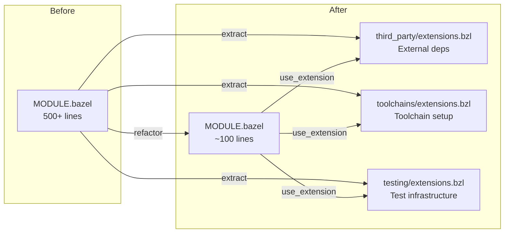

# Bazel Module Extensions: A Practical Guide

**When and How to Use Module Extensions in Bzlmod (Bazel 7+/8+)**

With WORKSPACE disabled in Bazel 8 and slated for removal in Bazel 9, module extensions have become essential for advanced dependency management. This guide covers practical use cases with patterns you can apply to your own projects.

---

## What Are Module Extensions?

Module extensions bridge the gap between MODULE.bazel's declarative nature and the need for dynamic repository generation. Unlike WORKSPACE, MODULE.bazel cannot call macros or execute arbitrary Starlark—extensions provide that escape hatch.



**Key property:** Extensions are evaluated **lazily**—only when a repository they generate is actually referenced in the build.

---

## Use Case 1: Conditional Repository Generation

### Problem

You have files that only exist on certain machines (e.g., build cluster nodes with proprietary libraries, licensed tools, or hardware-specific SDKs). A `local_repository` in MODULE.bazel would fail on machines without those files.

### Solution

Use a module extension with a repository rule that checks conditions at fetch time.



### Implementation Pattern

```python
# conditional_repo.bzl
def _conditional_repo_impl(rctx):
    path = rctx.path(rctx.attr.path)
    if path.exists:
        # On build server: symlink real files
        for child in path.readdir():
            rctx.symlink(child, child.basename)
        rctx.file("BUILD.bazel", """
filegroup(
    name = "libs",
    srcs = glob(["**/*.so"]),
    visibility = ["//visibility:public"],
)
""")
    else:
        # Not on build server: create stub with same targets
        rctx.file("BUILD.bazel", """
filegroup(
    name = "libs",
    srcs = [],  # Empty but valid
    visibility = ["//visibility:public"],
)
""")

conditional_repo = repository_rule(
    implementation = _conditional_repo_impl,
    attrs = {"path": attr.string(mandatory = True)},
    local = True,
)

# extensions.bzl
def _vendor_sdk_impl(ctx):
    conditional_repo(
        name = "vendor_sdk",
        path = "/opt/vendor/sdk/v2.0",
    )

vendor_sdk = module_extension(
    implementation = _vendor_sdk_impl,
    tag_classes = {"configure": tag_class()},
)
```

### Usage in MODULE.bazel

```python
vendor = use_extension("//third_party:extensions.bzl", "vendor_sdk")
vendor.configure()
use_repo(vendor, "vendor_sdk")
```

### Benefits

- Build graph is **always valid** regardless of where Bazel runs
- Same target names work everywhere (graceful degradation)
- No conditional logic needed in BUILD files
- CI can run on any machine without special setup

---

## Use Case 2: Cross-Module Dependency Aggregation

### Problem

Multiple modules in your dependency graph need to configure the same tool (e.g., compiler targets, Maven artifacts, Go modules). Each module declares what it needs, but there should be one unified configuration.

### Solution

Module extensions can iterate over ALL modules in the dependency graph and aggregate their tags.



### Implementation Pattern

```python
def _compiler_config_impl(ctx):
    targets = []

    # Iterate ALL modules in the dependency graph
    for module in ctx.modules:
        for config in module.tags.targets:
            for target in config.architectures:
                if target not in targets:
                    targets.append(target)

    # Create single unified repo with all targets
    _create_compiler_config(name = "compiler_config", targets = targets)

compiler_extension = module_extension(
    implementation = _compiler_config_impl,
    tag_classes = {
        "targets": tag_class(
            attrs = {"architectures": attr.string_list()},
        ),
    },
)
```

### Usage Across Modules

```python
# In root MODULE.bazel
compiler = use_extension("@rules_compiler//:extensions.bzl", "compiler_extension")
compiler.targets(architectures = ["X86", "ARM64"])
use_repo(compiler, "compiler_config")

# In a dependency's MODULE.bazel
compiler = use_extension("@rules_compiler//:extensions.bzl", "compiler_extension")
compiler.targets(architectures = ["RISCV"])  # Will be merged!
```

### Benefits

- Each module declares only what it needs
- Extension resolves conflicts globally
- Single source of truth for configuration
- No version conflicts or duplicate definitions

---

## Use Case 3: Platform Detection at Fetch Time

### Problem

You need different toolchains or sysroots based on the host OS/distribution, but this can only be determined at runtime, not declaratively in MODULE.bazel.

### Solution

Use a module extension that detects the platform and generates appropriate constraints.



### Implementation Pattern

```python
def _detect_platform_impl(rctx):
    os_name = "unknown"
    os_release_path = rctx.path("/etc/os-release")

    if os_release_path.exists:
        content = rctx.read(os_release_path)
        if "Ubuntu" in content or "Debian" in content:
            os_name = "debian"
        elif "Rocky" in content or "CentOS" in content or "Red Hat" in content:
            os_name = "rhel"
    else:
        # Likely macOS or Windows
        result = rctx.execute(["uname", "-s"])
        if result.return_code == 0 and "Darwin" in result.stdout:
            os_name = "macos"

    # Generate BUILD with constraint_setting and constraint_values
    rctx.file("BUILD.bazel", """
package(default_visibility = ["//visibility:public"])

constraint_setting(name = "host_os")

constraint_value(name = "debian", constraint_setting = ":host_os")
constraint_value(name = "rhel", constraint_setting = ":host_os")
constraint_value(name = "macos", constraint_setting = ":host_os")
constraint_value(name = "unknown", constraint_setting = ":host_os")

platform(
    name = "detected_host",
    parents = ["@local_config_platform//:host"],
    constraint_values = [":{os}"],
)
""".format(os = os_name))

_detect_platform = repository_rule(
    implementation = _detect_platform_impl,
    local = True,
    configure = True,  # Re-run when environment changes
)

def _platform_detection_impl(module_ctx):
    _detect_platform(name = "detected_platform")
    return module_ctx.extension_metadata(reproducible = True)

platform_detection = module_extension(implementation = _platform_detection_impl)
```

### Benefits

- Automatic toolchain selection based on host
- No manual `--platforms` flags needed
- Works transparently across different CI environments
- Supports heterogeneous build farms

---

## Use Case 4: Lazy HTTP Downloads

### Problem

You have many external dependencies declared, but downloading all of them during analysis slows down builds, even when they're not needed for the current target.

### Solution

Move `http_archive` calls into a module extension. Repository rules in extensions are lazy—they only execute when the repo is actually referenced.



### Implementation Pattern

```python
load("@bazel_tools//tools/build_defs/repo:http.bzl", "http_archive")

def _lazy_deps_impl(ctx):
    for module in ctx.modules:
        for dep in module.tags.archive:
            http_archive(
                name = dep.name,
                urls = dep.urls,
                sha256 = dep.sha256,
                strip_prefix = dep.strip_prefix,
            )

lazy_deps = module_extension(
    implementation = _lazy_deps_impl,
    tag_classes = {
        "archive": tag_class(attrs = {
            "name": attr.string(mandatory = True),
            "urls": attr.string_list(mandatory = True),
            "sha256": attr.string(),
            "strip_prefix": attr.string(),
        }),
    },
)
```

### Usage

```python
deps = use_extension("//:extensions.bzl", "lazy_deps")

deps.archive(
    name = "large_test_data",
    urls = ["https://example.com/testdata-10gb.tar.gz"],
    sha256 = "abc123...",
)

deps.archive(
    name = "optional_tool",
    urls = ["https://example.com/tool.tar.gz"],
    sha256 = "def456...",
)

use_repo(deps, "large_test_data", "optional_tool")
```

### Benefits

- Faster analysis phase
- Only download what's actually needed for the current build
- Better CI cache utilization
- Reduced network bandwidth

---

## Use Case 5: Encapsulation & Code Organization

### Problem

Your MODULE.bazel is getting cluttered with many repository declarations, making it hard to maintain and review.

### Solution

Move related repositories into a module extension in a separate `.bzl` file.



### Benefits

- Clear separation of concerns
- Better code ownership (different teams own different extensions)
- Easier to add new repositories without touching MODULE.bazel
- Documentation colocated with implementation
- Simpler code review (changes scoped to relevant files)

---

## Quick Reference: When to Use Module Extensions

| Scenario | Use Extension? | Reason |
|----------|:-------------:|--------|
| Path might not exist | Yes | Can check and generate stub |
| Need cross-module data | Yes | Only extensions see all modules |
| Want lazy downloads | Yes | Repo rules in extensions are lazy |
| Platform-specific logic | Yes | Can detect OS/arch at fetch time |
| Many related repos | Yes | Better organization |
| Simple http_archive | Maybe | `use_repo_rule` might suffice |
| Static local_repository | Maybe | Unless path might not exist |

---

## Best Practices

### 1. Mark Extensions Reproducible When Possible

```python
def _my_extension_impl(ctx):
    # ... create repos ...
    return ctx.extension_metadata(reproducible = True)
```

This keeps `MODULE.bazel.lock` smaller and more stable.

### 2. Declare OS/Arch Dependencies

```python
module_extension(
    implementation = _impl,
    os_dependent = True,    # Set if behavior varies by OS
    arch_dependent = True,  # Set if behavior varies by arch
)
```

### 3. Use Empty Tag Classes for Simple Extensions

```python
# No need for complex tag attributes if you don't need user input
tag_classes = {"configure": tag_class()}
```

### 4. Single .bzl File Per Extension

Don't re-export extensions from multiple files—this creates separate identities and can cause duplicate evaluation.

### 5. Handle Missing Dependencies Gracefully

Always provide fallback behavior when optional dependencies aren't available, rather than failing the build.

---

## References

- [Bazel Official: Module Extensions](https://bazel.build/external/extension)
- [Bazel Official: Bzlmod Migration Guide](https://bazel.build/external/migration)
- [EngFlow: Writing Bazel Rules - Module Extensions](https://blog.engflow.com/2025/10/14/writing-bazel-rules-module-extensions/)
- [EngFlow: Migrating to Bzlmod - Toolchainization](https://blog.engflow.com/2025/05/14/migrating-to-bazel-modules-aka-bzlmod---toolchainization/)

---

*Published: January 2025*
