# Dynamic Shapes in Static ML Compilers

**Handling MoE Routing, Variable Sequences, and JIT Rematerialization**

---

## The Fundamental Tension

Static ML compilers optimize aggressively by assuming fixed tensor shapes at compile time. But modern LLMs demand flexibility:

- **Variable sequence lengths**: User prompts range from 10 to 100,000 tokens
- **MoE routing**: Different experts activate per token
- **Early exit**: Skip layers when confidence is high
- **Speculative decoding**: Variable number of draft tokens

How do we preserve static compiler optimizations while supporting dynamic behavior?

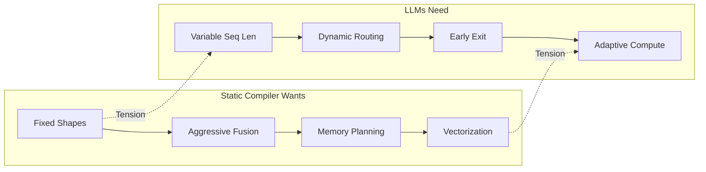

---

## Three Categories of Dynamism

Not all dynamic shapes are equal. Understanding the category determines the solution:


| Type | Example | Compile-Time Knowledge | Runtime Overhead |
|------|---------|----------------------|------------------|
| **Bounded** | Seq length ≤ 4096 | Max bound known | Padding waste |
| **Data-Dependent** | MoE routing | Distribution unknown | Dispatch overhead |
| **Control-Dependent** | Early exit | Condition unknown | Branch misprediction |

---

## Technique 1: Symbolic Shapes + Runtime Specialization

Compile with symbolic dimensions, specialize at runtime when actual shapes are known.

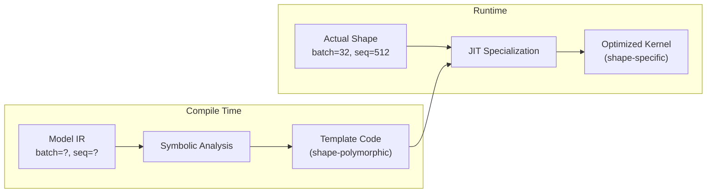

### Trade-offs

| Approach | Compilation | Runtime | Memory |
|----------|-------------|---------|--------|
| **Fully Static** | Once, ahead-of-time | Fastest | Optimal |
| **JIT per Shape** | On first encounter | Fast after warmup | Kernel cache grows |
| **Fully Dynamic** | Minimal | Slowest | Minimal |

### Implementation Pattern

```mlir
// Symbolic shape in MLIR
func.func @attention(%q: tensor<?x?x64xf16>,   // [batch, seq, head_dim]
                     %k: tensor<?x?x64xf16>,
                     %v: tensor<?x?x64xf16>)
    -> tensor<?x?x64xf16> {
  // Compiler generates shape-polymorphic code
  // Runtime specializes for actual [32, 512, 64]
}
```

---

## Technique 2: Worklist-Based Dynamic Dispatch (MoE)

For Mixture-of-Experts, compile static expert kernels but route dynamically at runtime.

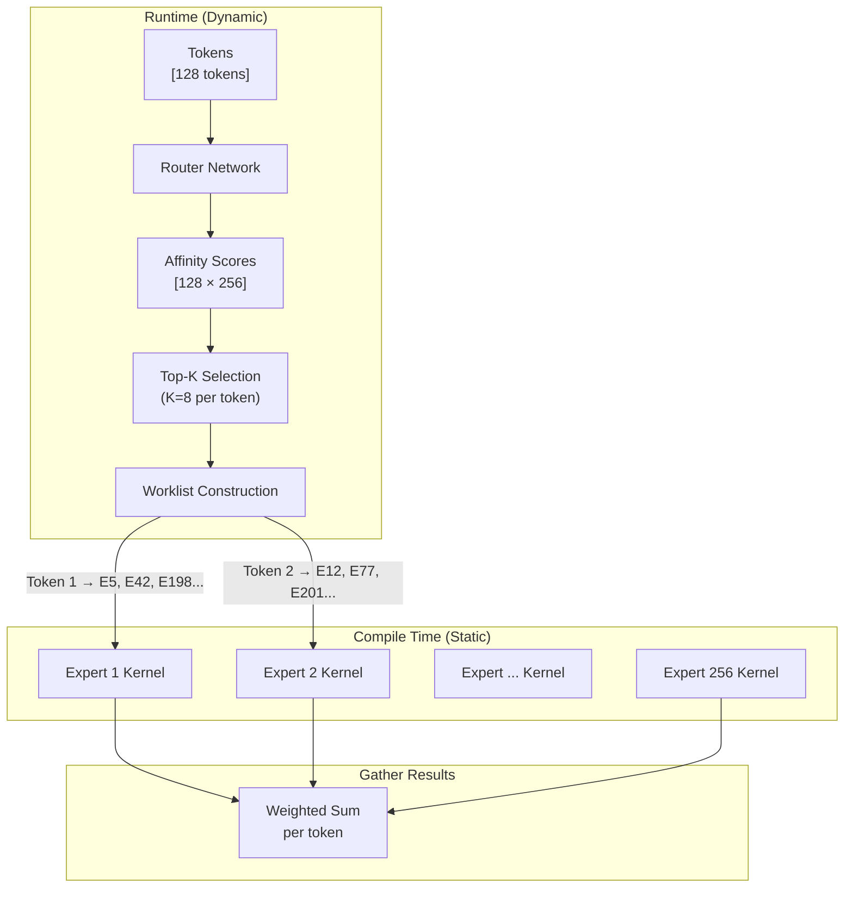

### Key Insight: Static Kernels, Dynamic Routing

```python
# Pseudo-code for MoE dispatch
def moe_forward(tokens, router, experts):
    # Static: All expert kernels pre-compiled
    # Dynamic: Which experts to call per token

    scores = router(tokens)                    # [batch, num_experts]
    top_k_experts = scores.topk(k=8, dim=-1)   # Dynamic selection

    # Build worklist: which tokens go to which experts
    worklist = build_worklist(top_k_experts)   # Runtime construction

    # Dispatch (can be parallel across experts)
    results = []
    for expert_id, token_indices in worklist:
        expert_tokens = tokens[token_indices]
        expert_output = experts[expert_id](expert_tokens)  # Static kernel
        results.append((token_indices, expert_output))

    return gather_and_combine(results, scores)
```

### Memory Layout Considerations

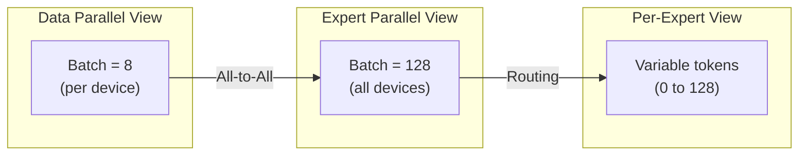

---

## Technique 3: JIT Tile Rematerialization

When memory pressure is high, evict computed tiles and recompute on demand.

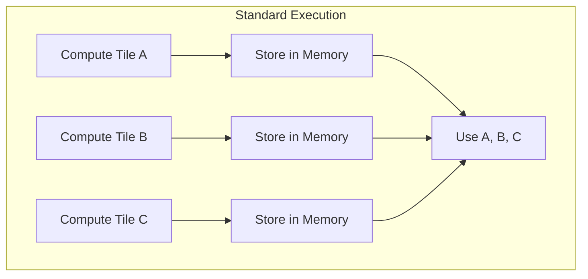

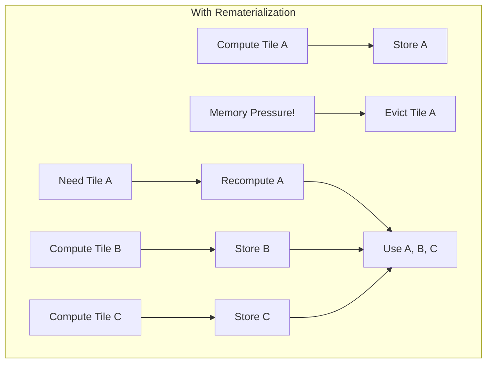

### When to Rematerialize vs. Store

| Factor | Favor Recompute | Favor Store |
|--------|-----------------|-------------|
| **Compute Cost** | Cheap (elementwise) | Expensive (matmul) |
| **Memory Pressure** | High | Low |
| **Reuse Count** | Low (used once) | High (used many times) |
| **Bandwidth** | Memory-bound | Compute-bound |

### Decision Function

```python
def should_rematerialize(tile, memory_state):
    compute_cost = estimate_flops(tile)
    memory_cost = tile.size_bytes
    reuse_count = count_future_uses(tile)
    pressure = memory_state.utilization

    # Heuristic: rematerialize if cheap and memory-pressured
    if pressure > 0.9 and compute_cost < THRESHOLD:
        if reuse_count <= 2:
            return True
    return False
```

---

## Technique 4: Padded Execution with Masking

The simplest approach: pad all inputs to maximum size, mask invalid positions.

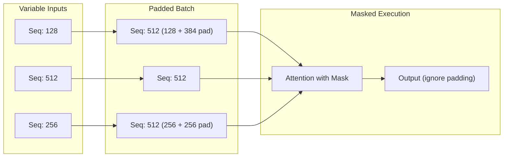

### Trade-offs

| Pros | Cons |
|------|------|
| Simple implementation | Wasted compute on padding |
| Static shapes everywhere | Memory overhead |
| No runtime dispatch | Poor for high variance |
| Batch-friendly | Latency = max sequence |

### When Padding Works Well

- Sequences cluster around similar lengths
- Batch size is large (amortizes padding overhead)
- Hardware prefers uniform shapes (TPUs, matrix cores)

---

## Technique 5: Bucketed Compilation

Compile kernels for discrete shape "buckets", select at runtime.

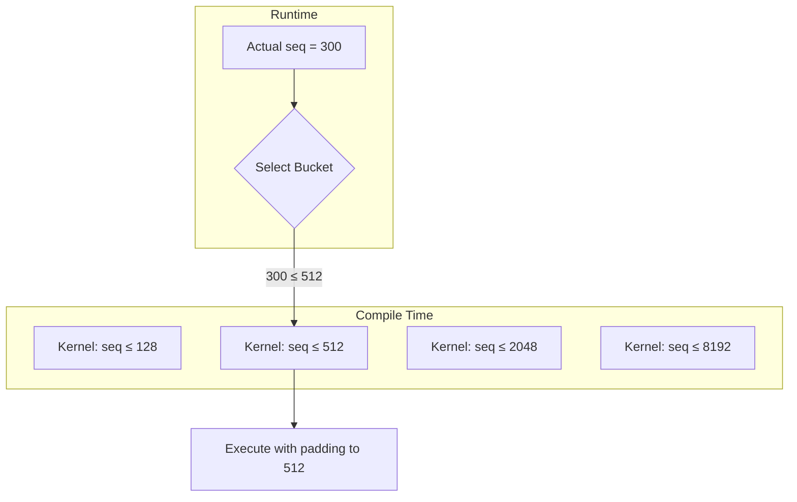

### Bucket Selection Strategy

```python
BUCKETS = [128, 256, 512, 1024, 2048, 4096, 8192]

def select_bucket(seq_len):
    for bucket in BUCKETS:
        if seq_len <= bucket:
            return bucket
    return seq_len  # Fallback: compile new kernel
```

---

## Case Study: MoE in DeepSeek-V3

DeepSeek-V3 demonstrates production-grade dynamic shape handling:

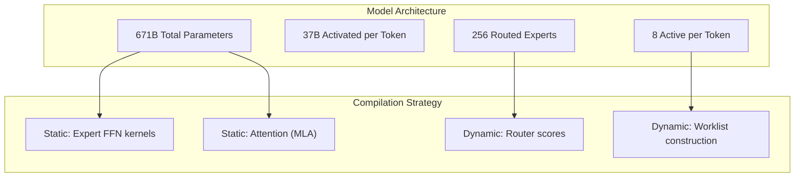

### The Hybrid Approach

| Component | Static/Dynamic | Reason |
|-----------|---------------|--------|
| Expert FFN weights | Static | Fixed per expert |
| Expert kernel code | Static | Same computation, different data |
| Router network | Static | Fixed architecture |
| Routing decision | Dynamic | Data-dependent per token |
| Token-to-expert mapping | Dynamic | Changes every forward pass |
| Expert output gathering | Dynamic | Variable tokens per expert |

---

## Combining Techniques: A Practical Pipeline

Real compilers combine multiple techniques:

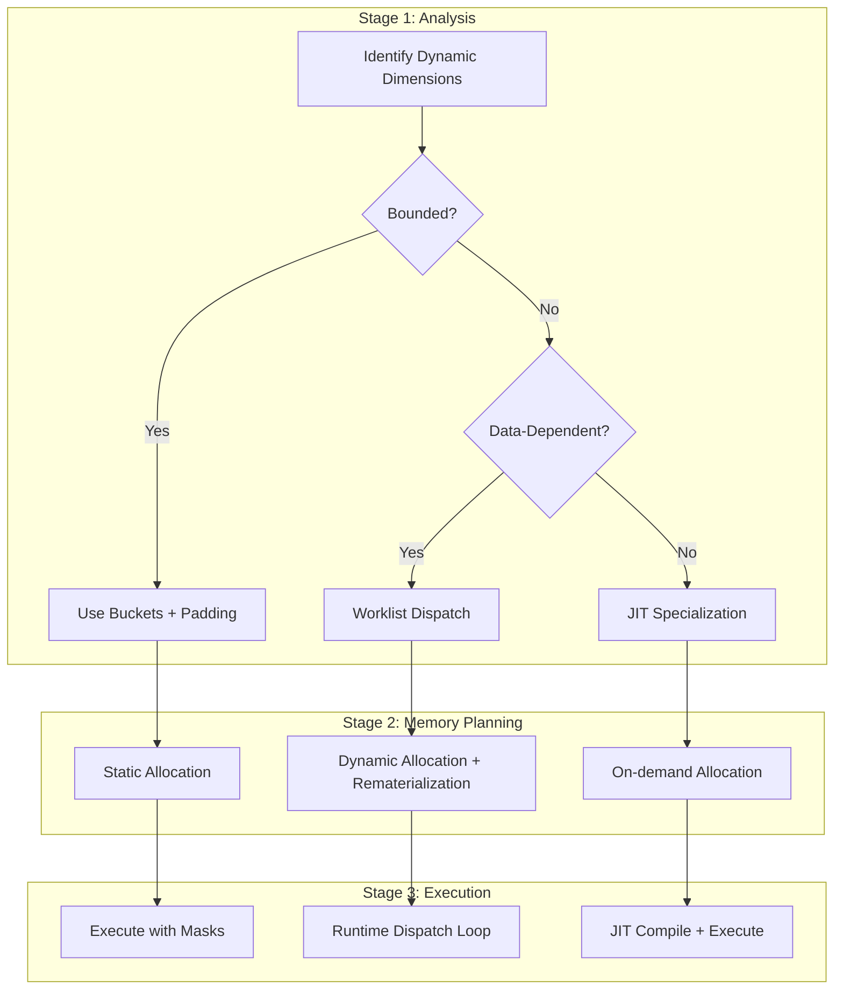

---

## Performance Comparison

| Technique | Compilation Time | Runtime Overhead | Memory Efficiency | Best For |
|-----------|------------------|------------------|-------------------|----------|
| **Fully Static** | Fast | None | Optimal | Fixed workloads |
| **Symbolic + JIT** | Deferred | Warmup | Good | Variable batch |
| **Bucketed** | N × buckets | Selection | Moderate | Sequence length |
| **Padded** | Fast | Mask overhead | Poor | Low variance |
| **Worklist MoE** | Per expert | Dispatch | Variable | Sparse activation |
| **Rematerialization** | Once | Recompute | Optimal | Memory-bound |

---

## Key Takeaways

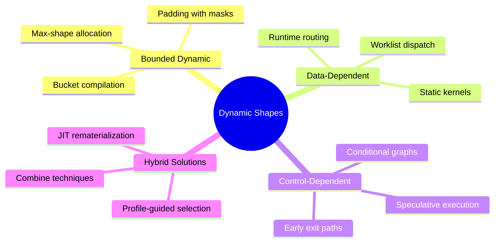

1. **Categorize your dynamism**: Bounded, data-dependent, or control-dependent require different solutions

2. **Static where possible**: Compile expert kernels statically, route dynamically

3. **Worklists enable MoE**: Decouple static computation from dynamic dispatch

4. **Rematerialization trades compute for memory**: Essential for long sequences

5. **No silver bullet**: Production systems combine multiple techniques based on workload

---

## Further Reading

- [XLA Dynamic Shapes](https://www.tensorflow.org/xla/shapes) - TensorFlow's approach
- [TorchDynamo](https://pytorch.org/docs/stable/dynamo/) - PyTorch's JIT compiler
- [vLLM PagedAttention](https://arxiv.org/abs/2309.06180) - Dynamic KV cache management
- [Megablocks MoE](https://arxiv.org/abs/2211.15841) - Efficient MoE implementation

---

*Static compilation and dynamic execution aren't opposites—they're partners. The art is knowing where to draw the line.*
