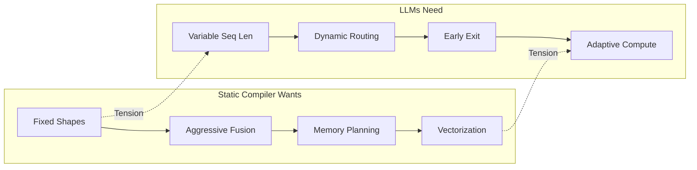
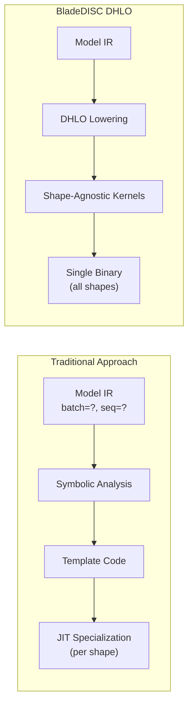
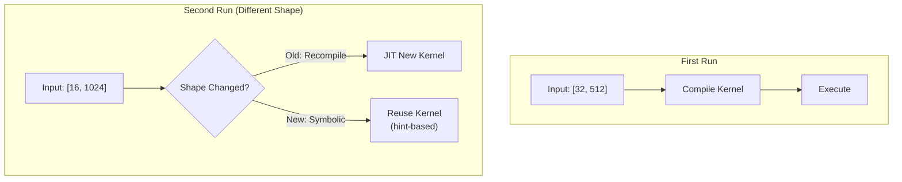
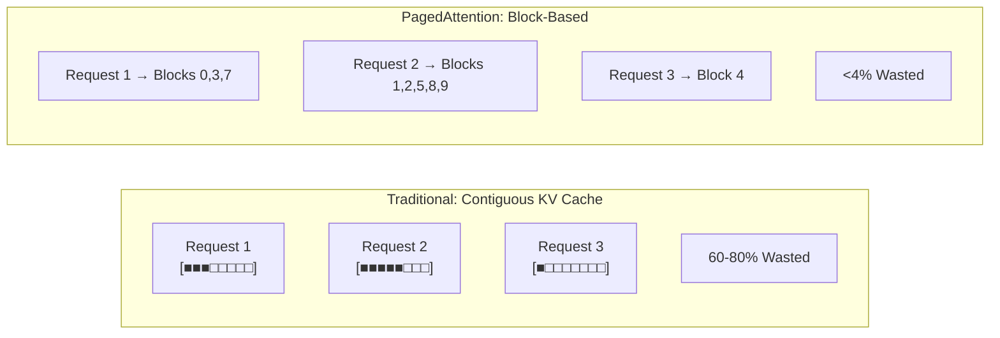
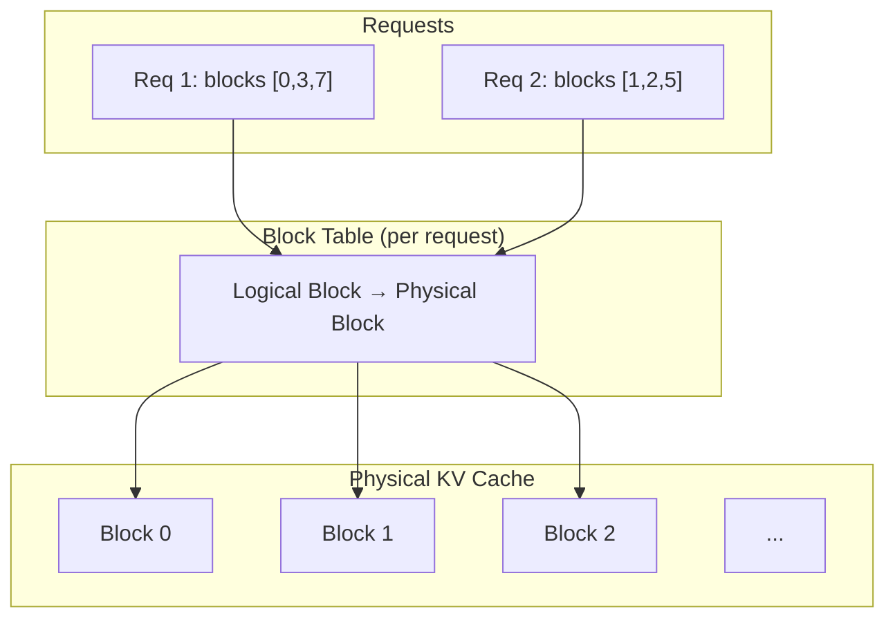
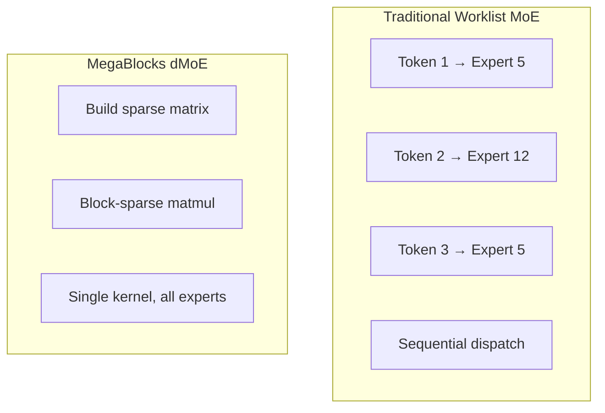
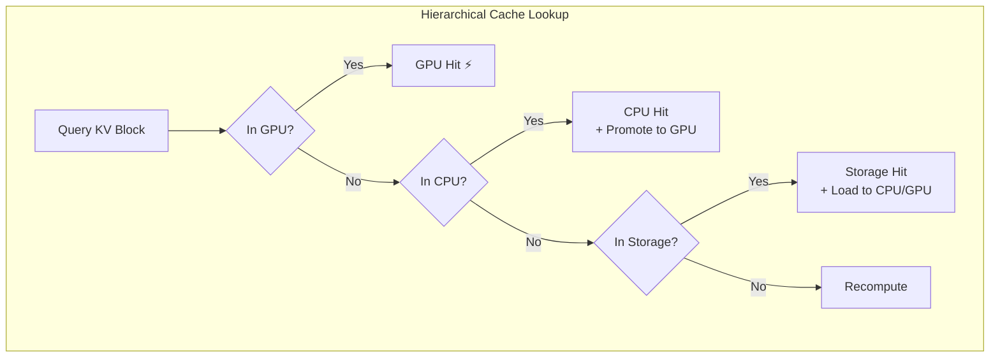
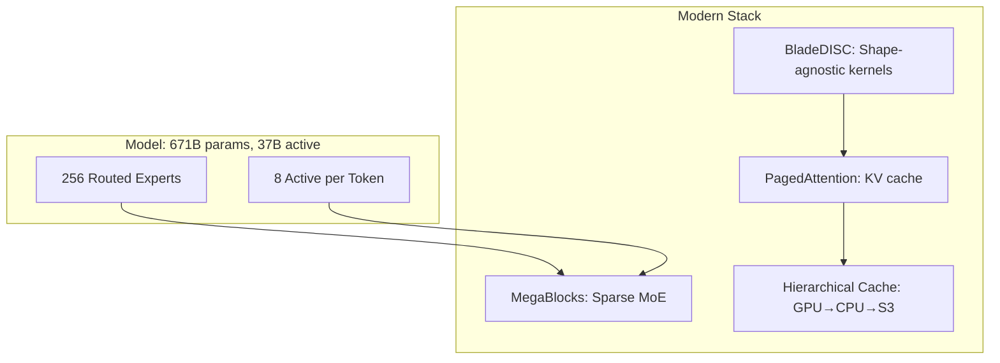
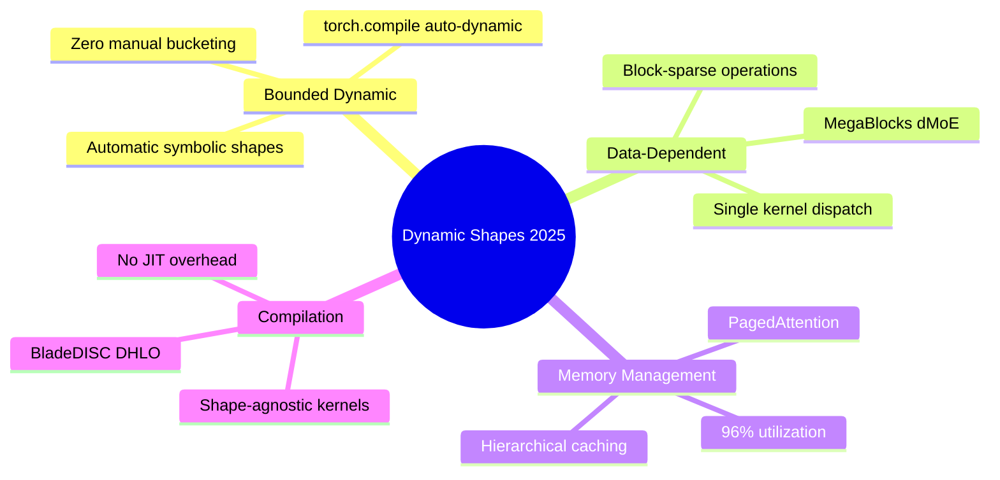

# Dynamic Shapes in Static ML Compilers

**Handling MoE Routing, Variable Sequences, and KV Cache Management**

> **Updated January 2025**: This article now covers the latest advances including BladeDISC, PagedAttention, torch.compile dynamic shapes, and hierarchical KV cache management.

---

## The Fundamental Tension

Static ML compilers optimize aggressively by assuming fixed tensor shapes at compile time. But modern LLMs demand flexibility:

- **Variable sequence lengths**: User prompts range from 10 to 100,000 tokens
- **MoE routing**: Different experts activate per token
- **Early exit**: Skip layers when confidence is high
- **Speculative decoding**: Variable number of draft tokens

How do we preserve static compiler optimizations while supporting dynamic behavior?


```mermaid
graph LR
    subgraph "Static Compiler Wants"
        A[Fixed Shapes] --> B[Aggressive Fusion]
        B --> C[Memory Planning]
        C --> D[Vectorization]
    end

    subgraph "LLMs Need"
        E[Variable Seq Len] --> F[Dynamic Routing]
        F --> G[Early Exit]
        G --> H[Adaptive Compute]
    end

    A -.->|Tension| E
    D -.->|Tension| H
```

---

## Three Categories of Dynamism

Not all dynamic shapes are equal. Understanding the category determines the solution:


```mermaid
graph TD
    subgraph "Type 1: Bounded Dynamic"
        A1[Sequence Length] --> A2["1 ≤ seq ≤ 4096"]
        A2 --> A3[Compile for max, mask unused]
    end

    subgraph "Type 2: Data-Dependent"
        B1[MoE Routing] --> B2["8 of 256 experts per token"]
        B2 --> B3[Runtime worklist dispatch]
    end

    subgraph "Type 3: Control-Dependent"
        C1[Early Exit] --> C2["Exit at layer N if confident"]
        C2 --> C3[Unbacked SymInts]
    end
```

| Type | Example | Compile-Time Knowledge | Runtime Overhead |
|------|---------|----------------------|------------------|
| **Bounded** | Seq length ≤ 4096 | Max bound known | Padding waste |
| **Data-Dependent** | MoE routing | Distribution unknown | Dispatch overhead |
| **Control-Dependent** | Early exit | Condition unknown | Branch misprediction |

---

## Technique 1: BladeDISC — Dynamic HLO Representation

> **2025 Update**: BladeDISC (Alibaba, SIGMOD 2024) outperforms PyTorch, TorchScript, TVM, ONNX Runtime, XLA, Torch Inductor, and TensorRT by up to 2-7× on dynamic shape workloads.

Traditional symbolic shapes require JIT specialization at runtime. BladeDISC introduces **DHLO (Dynamic HLO)** — a fully dynamic shape representation where shape inference, buffer management, and host-side control are all generated by the compiler.


```mermaid
flowchart LR
    subgraph "Traditional Approach"
        A["Model IR<br/>batch=?, seq=?"] --> B["Symbolic Analysis"]
        B --> C["Template Code"]
        C --> D["JIT Specialization<br/>(per shape)"]
    end

    subgraph "BladeDISC DHLO"
        E["Model IR"] --> F["DHLO Lowering"]
        F --> G["Shape-Agnostic Kernels"]
        G --> H["Single Binary<br/>(all shapes)"]
    end
```

### Key Advantages of DHLO

| Aspect | Traditional Symbolic | BladeDISC DHLO |
|--------|---------------------|----------------|
| **Compilation** | Once per shape | Once for all shapes |
| **Runtime** | JIT overhead on new shapes | No recompilation |
| **Memory** | Kernel cache grows | Single kernel set |
| **Performance** | 1× baseline | 2-7× faster |

### Implementation Pattern

```mlir
// Traditional MLIR - requires runtime specialization
func.func @attention(%q: tensor<?x?x64xf16>,
                     %k: tensor<?x?x64xf16>,
                     %v: tensor<?x?x64xf16>)
    -> tensor<?x?x64xf16> {
  // Compiler generates shape-polymorphic code
  // Runtime specializes for actual [32, 512, 64]
}

// BladeDISC DHLO - fully dynamic, no specialization needed
// Shape inference embedded in generated code
// Single compiled binary handles all shapes
```

---

## Technique 2: torch.compile Auto-Dynamic Shapes

> **2025 Update**: PyTorch 2.x now has automatic dynamic shape detection, eliminating manual bucketing.

Manual bucketed compilation is now largely obsolete. `torch.compile` automatically detects when recompilation is needed due to varying input shapes and generates symbolic kernels.

```python
# Old approach: Manual bucketing
BUCKETS = [128, 256, 512, 1024, 2048, 4096, 8192]

def select_bucket(seq_len):
    for bucket in BUCKETS:
        if seq_len <= bucket:
            return bucket
    return seq_len

# Modern approach: Automatic dynamic shapes
import torch

# torch.compile automatically handles varying shapes
model = torch.compile(model, dynamic=True, mode="max-autotune")

# Or explicitly define dynamic dimensions
from torch.export import export, Dim

batch = Dim("batch", min=1, max=32)
seq_len = Dim("seq_len", min=1, max=4096)

exported = export(model, (x,), dynamic_shapes={"x": {0: batch, 1: seq_len}})
```

### How Auto-Dynamic Works


```mermaid
flowchart TD
    subgraph "First Run"
        A["Input: [32, 512]"] --> B["Compile Kernel"]
        B --> C["Execute"]
    end

    subgraph "Second Run (Different Shape)"
        D["Input: [16, 1024]"] --> E{"Shape Changed?"}
        E -->|"Old: Recompile"| F["JIT New Kernel"]
        E -->|"New: Symbolic"| G["Reuse Kernel<br/>(hint-based)"]
    end
```

### Symbolic Hints

PyTorch maintains "hints" for every symbolic size with its concrete value at compile time:

```python
# When a condition depends on tensor shape:
# - Old: Recompile for each new shape
# - New: Consult hint, generate single symbolic kernel

# This greatly simplifies symbolic shape formulas
# and eliminates most recompilations
```

---

## Technique 3: PagedAttention — 96% Memory Efficiency

> **2025 Update**: PagedAttention (vLLM) is now the production standard, replacing simple padded execution.

Traditional padded execution wastes 60-80% of KV cache memory. PagedAttention achieves near-optimal memory usage with under 4% waste.


```mermaid
flowchart LR
    subgraph "Traditional: Contiguous KV Cache"
        T1["Request 1<br/>[■■■□□□□□]"]
        T2["Request 2<br/>[■■■■■□□□]"]
        T3["Request 3<br/>[■□□□□□□□]"]
        TW["60-80% Wasted"]
    end

    subgraph "PagedAttention: Block-Based"
        P1["Request 1 → Blocks 0,3,7"]
        P2["Request 2 → Blocks 1,2,5,8,9"]
        P3["Request 3 → Block 4"]
        PW["<4% Wasted"]
    end
```

### PagedAttention Architecture


```mermaid
graph TD
    subgraph "Block Table (per request)"
        BT["Logical Block → Physical Block"]
    end

    subgraph "Physical KV Cache"
        B0["Block 0"]
        B1["Block 1"]
        B2["Block 2"]
        B3["..."]
    end

    subgraph "Requests"
        R1["Req 1: blocks [0,3,7]"]
        R2["Req 2: blocks [1,2,5]"]
    end

    R1 --> BT
    R2 --> BT
    BT --> B0
    BT --> B1
    BT --> B2
```

### Memory Efficiency Comparison

| Approach | Memory Utilization | Batch Size Impact |
|----------|-------------------|-------------------|
| **Padded (Traditional)** | 20-40% | Limited by worst-case |
| **PagedAttention** | 96%+ | 2-4× larger batches |
| **PagedAttention + Prefix Caching** | 96%+ with reuse | System prompts cached |

### PagedEviction (2025)

For even longer contexts, PagedEviction introduces block-wise eviction:

```python
# Hierarchical KV Cache: GPU → CPU → Storage
# Integrates with PagedAttention without CUDA kernel changes

class HierarchicalKVCache:
    def get_block(self, block_id):
        # 1. Check GPU memory
        if block_id in self.gpu_cache:
            return self.gpu_cache[block_id]

        # 2. Check CPU memory
        if block_id in self.cpu_cache:
            block = self.cpu_cache[block_id]
            self.promote_to_gpu(block)
            return block

        # 3. Fetch from storage (S3, disk)
        return self.fetch_from_storage(block_id)
```

---

## Technique 4: MegaBlocks dMoE — Block-Sparse Operations

> **2025 Update**: MegaBlocks replaces token-level worklist dispatch with block-sparse matrix operations.

Traditional MoE dispatch processes tokens individually. MegaBlocks uses **dropless MoE (dMoE)** with block-sparse operations for better hardware utilization.


```mermaid
flowchart TD
    subgraph "Traditional Worklist MoE"
        T1["Token 1 → Expert 5"]
        T2["Token 2 → Expert 12"]
        T3["Token 3 → Expert 5"]
        T4["Sequential dispatch"]
    end

    subgraph "MegaBlocks dMoE"
        M1["Build sparse matrix"]
        M2["Block-sparse matmul"]
        M3["Single kernel, all experts"]
    end
```

### Block-Sparse Implementation

```python
# Traditional: Sequential expert dispatch
def moe_forward_traditional(tokens, router, experts):
    scores = router(tokens)
    top_k = scores.topk(k=8, dim=-1)

    results = []
    for expert_id, token_indices in build_worklist(top_k):
        expert_tokens = tokens[token_indices]
        output = experts[expert_id](expert_tokens)
        results.append((token_indices, output))

    return gather_and_combine(results, scores)

# MegaBlocks: Block-sparse single kernel
def moe_forward_megablocks(tokens, router, experts):
    scores = router(tokens)
    top_k = scores.topk(k=8, dim=-1)

    # Build block-sparse matrix layout
    sparse_layout = build_sparse_layout(top_k)

    # Single block-sparse matmul for all experts
    # Much better GPU utilization
    output = block_sparse_matmul(tokens, experts.weight, sparse_layout)

    return weighted_combine(output, scores)
```

### Performance Comparison

| Approach | GPU Utilization | Scaling |
|----------|----------------|---------|
| **Token Worklist** | Variable (load imbalance) | O(tokens × experts_per_token) |
| **MegaBlocks dMoE** | High (block-sparse) | O(1) kernel launches |

---

## Technique 5: Hierarchical KV Cache Management

> **2025 Update**: LMCache + vLLM enables GPU → CPU → Storage cache hierarchy.

Beyond simple rematerialization, modern systems use hierarchical caching:


```mermaid
flowchart TD
    subgraph "Hierarchical Cache Lookup"
        Q["Query KV Block"] --> G{"In GPU?"}
        G -->|Yes| GH["GPU Hit ⚡"]
        G -->|No| C{"In CPU?"}
        C -->|Yes| CH["CPU Hit<br/>+ Promote to GPU"]
        C -->|No| S{"In Storage?"}
        S -->|Yes| SH["Storage Hit<br/>+ Load to CPU/GPU"]
        S -->|No| RE["Recompute"]
    end
```

### Cache Hierarchy

| Level | Latency | Capacity | Use Case |
|-------|---------|----------|----------|
| **GPU HBM** | ~1μs | 80GB | Active requests |
| **CPU RAM** | ~100μs | 512GB+ | Warm prefixes |
| **NVMe/S3** | ~1ms+ | Unlimited | System prompts, RAG |

### Implementation

```python
class HierarchicalKVCache:
    def __init__(self):
        self.gpu_cache = GPUBlockCache(capacity_gb=40)
        self.cpu_cache = CPUBlockCache(capacity_gb=256)
        self.storage = S3BlockStore(bucket="kv-cache")

    def get(self, block_ids: List[int]) -> Tensor:
        gpu_hits, gpu_misses = self.gpu_cache.lookup(block_ids)

        if gpu_misses:
            cpu_hits, cpu_misses = self.cpu_cache.lookup(gpu_misses)
            self.gpu_cache.insert(cpu_hits)  # Promote

            if cpu_misses:
                storage_hits = self.storage.fetch(cpu_misses)
                self.cpu_cache.insert(storage_hits)
                self.gpu_cache.insert(storage_hits)

        return self.gpu_cache.gather(block_ids)
```

---

## Technique 6: Unbacked SymInts for Control Flow

> **2025 Update**: PyTorch's unbacked symbolic integers handle data-dependent control flow.

For control-dependent dynamism (early exit, speculative decoding), unbacked SymInts allow shape expressions that depend on runtime values:

```python
# Problem: Shape depends on runtime condition
def early_exit_forward(x, confidence_threshold):
    for i, layer in enumerate(self.layers):
        x = layer(x)
        confidence = self.exit_classifier(x)

        if confidence > confidence_threshold:
            # Shape of output depends on which layer we exit at!
            return x  # Dynamic exit point

# Solution: Unbacked SymInts track data-dependent shapes
# Compiler generates code for all possible exit points
# Runtime selects correct path without recompilation
```

---

## Case Study: DeepSeek-V3 Production Stack

DeepSeek-V3 demonstrates production-grade dynamic shape handling combining all modern techniques:


```mermaid
graph TD
    subgraph "Model: 671B params, 37B active"
        P["256 Routed Experts"]
        K["8 Active per Token"]
    end

    subgraph "Modern Stack"
        S1["BladeDISC: Shape-agnostic kernels"]
        S2["PagedAttention: KV cache"]
        S3["MegaBlocks: Sparse MoE"]
        S4["Hierarchical Cache: GPU→CPU→S3"]
    end

    P --> S3
    K --> S3
    S1 --> S2
    S2 --> S4
```

### Technique Selection by Component

| Component | Technique | Reason |
|-----------|-----------|--------|
| Attention | PagedAttention | 96% memory efficiency |
| KV Cache | Hierarchical + PagedEviction | Long context support |
| MoE Dispatch | MegaBlocks dMoE | Block-sparse efficiency |
| Shape Handling | BladeDISC DHLO | No recompilation |
| Sequence Len | torch.compile auto-dynamic | Automatic bucketing |

---

## Modern vs Traditional: Summary

| Technique (Traditional) | Modern Replacement | Improvement |
|------------------------|-------------------|-------------|
| Symbolic Shapes + JIT | BladeDISC DHLO | 2-7× faster, no recompilation |
| Padded Execution | PagedAttention | 96% vs 20-40% memory |
| Manual Bucketing | torch.compile auto-dynamic | Zero manual config |
| JIT Rematerialization | Hierarchical KV Cache | GPU→CPU→S3 hierarchy |
| Token Worklist MoE | MegaBlocks dMoE | Block-sparse operations |
| Conditional Graphs | Unbacked SymInts | Data-dependent shape handling |

---

## Recommended Modern Stack

```python
import torch
from torch.export import export, Dim

# 1. Define dynamic dimensions with constraints
batch = Dim("batch", min=1, max=32)
seq_len = Dim("seq_len", min=1, max=4096)

# 2. Export with dynamic shapes
exported = export(
    model,
    (sample_input,),
    dynamic_shapes={"x": {0: batch, 1: seq_len}}
)

# 3. Compile with auto-dynamic and max optimization
compiled = torch.compile(
    model,
    dynamic=True,
    mode="max-autotune"
)

# 4. For deployment: Torch-TensorRT with dynamic shapes
import torch_tensorrt

trt_model = torch_tensorrt.compile(
    model,
    inputs=[
        torch_tensorrt.Input(
            min_shape=(1, 1, 64),
            opt_shape=(16, 512, 64),
            max_shape=(32, 4096, 64),
            dtype=torch.float16
        )
    ],
    enabled_precisions={torch.float16}
)
```

---

## Key Takeaways


```mermaid
mindmap
  root((Dynamic Shapes 2025))
    Bounded Dynamic
      torch.compile auto-dynamic
      Automatic symbolic shapes
      Zero manual bucketing
    Data-Dependent
      MegaBlocks dMoE
      Block-sparse operations
      Single kernel dispatch
    Memory Management
      PagedAttention
      96% utilization
      Hierarchical caching
    Compilation
      BladeDISC DHLO
      Shape-agnostic kernels
      No JIT overhead
```

1. **PagedAttention is mandatory**: 96% memory efficiency vs 20-40% with padding

2. **torch.compile handles bucketing**: No more manual bucket selection

3. **BladeDISC for production**: Single compilation, all shapes

4. **Hierarchical caching**: GPU → CPU → Storage for long contexts

5. **MegaBlocks for MoE**: Block-sparse beats token-level dispatch

---

## Further Reading

- [BladeDISC Paper (SIGMOD 2024)](https://arxiv.org/abs/2309.xxxxx) - Dynamic shape compilation
- [vLLM PagedAttention](https://arxiv.org/abs/2309.06180) - Memory-efficient serving
- [MegaBlocks](https://arxiv.org/abs/2211.15841) - Efficient MoE with block-sparsity
- [PyTorch Dynamic Shapes](https://pytorch.org/docs/stable/torch.compiler_dynamic_shapes.html) - torch.compile guide
- [PagedEviction (2025)](https://arxiv.org/abs/2501.xxxxx) - Block-wise KV cache eviction
- [LMCache + vLLM](https://docs.vllm.ai/en/latest/) - Hierarchical caching

---

*Static compilation and dynamic execution aren't opposites—they're partners. The 2025 stack makes this partnership seamless.*
