# Functional Simulation for Multi-Tile AI Accelerators

**Bridging the Gap Between RTL and Silicon**

---

## The Simulation Gap

When developing custom AI accelerators, teams face a fundamental timing problem:

| Simulation Type | Speed | Fidelity | When Available |
|-----------------|-------|----------|----------------|
| **RTL Simulation** | ~1-10 Hz | Cycle-accurate | Early design |
| **FPGA Emulation** | ~1-10 MHz | Near-accurate | Mid development |
| **Real Silicon** | GHz | Ground truth | Post tape-out |

RTL simulation is too slow for running real ML workloads. Real hardware doesn't exist yet. FPGA emulation requires expensive boards and long build times.

**Functional simulation** fills this gap: fast enough to run real firmware, accurate enough to validate system behavior.


---

## What We Model (and What We Skip)

Functional simulation isn't about modeling every transistor. It's about modeling **what matters for software validation**:


### What to Model in QEMU (Beyond CPU Emulation)

| Component | Why Model It? | How (QEMU + Extensions) |
|-----------|---------------|-------------------------|
| **Custom NoC** | Validates data routing, congestion, arbitration | QEMU TCG + custom MMIO devices; route traffic via sockets |
| **Memory Subsystem** | Tests bandwidth limits, bank conflicts | Emulate memory controllers with latency/bandwidth caps |
| **Accelerator Tiles** | Verify tile scheduling, DMA, interrupts | Model as QEMU platform devices; expose register interface |
| **Inter-Chip Communication** | Simulate multi-chip/module setups | Loopback TCP/UDP or vhost-user between QEMU instances |
| **Clock & Power Domains** | Validate DVFS, idle states | Inject synthetic delays or throttling based on workload |


### Key Modeling Decisions

| Component | Model Approach | Why |
|-----------|---------------|-----|
| **CPU Cores** | Full ISA emulation (QEMU TCG) | Firmware must execute correctly |
| **NoC** | Message-passing with configurable latency | Validates routing and deadlock-freedom |
| **Accelerator Units** | Functional compute (golden model) | Validates data flow, not timing |
| **Memory** | Bandwidth-capped flat address space | Validates addressing and bandwidth limits |
| **Interrupts** | Level-triggered delivery | Validates firmware interrupt handlers |
| **DMA Engines** | Async copy with completion interrupt | Validates firmware DMA programming |

---

## Architecture: Multi-Instance QEMU Simulation

For multi-tile systems, we run **separate QEMU instances** connected via sockets. This approach:

- Allows independent tile development and debugging
- Scales to arbitrary tile counts
- Enables distributed simulation across machines


---

## Socket-Based NoC Emulation

Each QEMU instance exposes a **chardev socket** for inter-tile communication. A routing table maps tile IDs to network addresses:


### Routing Table Format

A simple CSV maps tile IDs to socket endpoints:

```csv
# tile_id, die, x, y, host, port
0, 0, 0, 0, 127.0.0.1, 65000
1, 0, 0, 1, 127.0.0.1, 65001
2, 0, 1, 0, 127.0.0.1, 65002
3, 0, 1, 1, 127.0.0.1, 65003
600, 0, 0, 0, 127.0.0.1, 65100
```

This approach enables:
- **Local simulation**: All instances on localhost
- **Distributed simulation**: Instances across machines
- **Kubernetes deployment**: Each tile as a pod

---

## Orchestration with tmux

Managing multiple QEMU instances manually is tedious. We use **tmux** to:

1. Launch all instances in parallel
2. Display each tile in its own pane/window
3. Enable interactive debugging
4. Aggregate logs for analysis


### Configuration-Driven Simulation

A JSON configuration defines the simulation topology:

```json
{
  "tmux_split": "yes",
  "routing_table": "./routing_table.csv",
  "deployment": [{
    "host": {
      "memory": "512M",
      "port": 65100
    },
    "tiles": [
      {"tile_id": 0, "port": 65000, "firmware": "tile-0.elf", "cpus": 4},
      {"tile_id": 1, "port": 65001, "firmware": "tile-1.elf", "cpus": 4},
      {"tile_id": 2, "port": 65002, "firmware": "tile-2.elf", "cpus": 4},
      {"tile_id": 3, "port": 65003, "firmware": "tile-3.elf", "cpus": 4}
    ]
  }]
}
```

---

## Metrics That Matter (Verification KPIs)

Functional simulation isn't just about "it boots." We capture metrics that hardware architects and firmware teams actually care about:

### Key Performance Indicators

| Metric | Why It Matters | How to Measure |
|--------|----------------|----------------|
| **NoC Latency (avg/max)** | Predicts end-to-end inference delay | Timestamp packets at source/sink via shared memory or logs |
| **Memory Bandwidth Utilization** | Reveals bottlenecks before tape-out | Track bytes read/written per tile via QEMU device counters |
| **Tile Idle vs. Active %** | Measures compute efficiency | Log tile state transitions (busy/idle) from QEMU device |
| **Interrupt Latency** | Impacts real-time response | Inject event → measure host ISR response time |
| **End-to-End Throughput** | Ultimate system-level KPI (tokens/sec) | Drive workload from host → time completion |
| **Determinism / Reproducibility** | Critical for debug | Ensure identical seed → identical logs (use `-icount` in QEMU) |


### Metric Collection Architecture


### Trace-Based Analysis

Firmware emits structured trace events that are converted to Chrome Trace Format for visualization:

```
TS:000653209372 T:04 C:01 PERFETTO_TAG_BEGIN:COMPUTE
TS:000653215000 T:04 C:01 PERFETTO_TAG_END:COMPUTE
TS:000653215100 T:04 C:01 PERFETTO_TAG_BEGIN:SEND
TS:000653220000 T:04 C:01 PERFETTO_TAG_END:SEND
```

This enables:
- **Timeline visualization** in Perfetto/Chrome Tracing
- **Session-level analysis**: Track end-to-end latency
- **Tile-level analysis**: Identify stragglers


---

## Validation Strategy

### Test Hierarchy

```mermaid
graph TD
    subgraph "Unit Tests"
        U1[Single-tile compute]
        U2[Memory operations]
        U3[Interrupt handling]
    end

    subgraph "Integration Tests"
        I1[Two-tile communication]
        I2[Loopback: send → receive → verify]
        I3[Multi-hop routing]
    end

    subgraph "System Tests"
        S1[Full topology boot]
        S2[ML workload execution]
        S3[Error injection & recovery]
    end

    subgraph "Correlation"
        C1[Compare vs RTL golden]
        C2[Compare vs FPGA results]
        C3[Compare vs silicon]
    end

    U1 --> I1
    U2 --> I1
    I1 --> S1
    I2 --> S2
    S2 --> C1
    C1 --> C2
    C2 --> C3
```



### Loopback Tests

The simplest integration test validates the full data path:


### Correlation Metrics

Track these across simulation levels to build confidence:

| Metric | FunSim | FPGA | Silicon | Status |
|--------|--------|------|---------|--------|
| Compute result | 0xDEADBEEF | 0xDEADBEEF | 0xDEADBEEF | PASS |
| Message count | 1024 | 1024 | 1024 | PASS |
| Relative ordering | A→B→C | A→B→C | A→B→C | PASS |
| Cycle count | N/A | 50,000 | 48,500 | ~3% delta |

---

## Practical Implementation Patterns

### 1. QEMU Device Properties

Pass configuration to QEMU devices via `-global`:

```bash
qemu-system-riscv64 \
  -global driver=noc,property=routing_table,value=./routing.csv \
  -global driver=noc,property=tile_id,value=0 \
  -chardev socket,id=noc_socket,host=0.0.0.0,port=65000,server=on,wait=off
```

### 2. Per-Tile Logging

Capture per-core output to separate files:

```bash
-chardev file,id=log_core0,path=log_tile0_core0.txt -serial chardev:log_core0
-chardev file,id=log_core1,path=log_tile0_core1.txt -serial chardev:log_core1
```

### 3. tmux Orchestration Pattern

```python
# Pseudocode for orchestrator
def launch_simulation(config):
    # Create tmux session
    subprocess.run(["tmux", "new-session", "-d", "-s", "sim"])

    # Generate routing table from config
    generate_routing_table(config)

    # Launch each tile in a pane
    for i, tile in enumerate(config["tiles"]):
        cmd = build_qemu_command(tile)
        if i == 0:
            subprocess.run(["tmux", "send-keys", "-t", "sim", cmd, "C-m"])
        else:
            subprocess.run(["tmux", "split-window", "-v", "-t", "sim"])
            subprocess.run(["tmux", "send-keys", "-t", f"sim.{i}", cmd, "C-m"])

    # Attach for interactive use
    subprocess.run(["tmux", "attach", "-t", "sim"])
```

---

## Key Takeaways


1. **Model what matters**: Focus on interfaces and behavior, not microarchitecture
2. **Socket-based NoC**: Simple, scalable inter-instance communication
3. **Configuration-driven**: JSON defines topology, orchestrator handles complexity
4. **Trace everything**: Perfetto-compatible traces enable deep analysis
5. **Correlate early**: Compare FunSim results with RTL/FPGA before silicon

---

## Further Reading

- [QEMU Documentation](https://www.qemu.org/docs/master/) - Device modeling and chardev sockets
- [Perfetto](https://perfetto.dev/) - Trace visualization
- [tmux Manual](https://man7.org/linux/man-pages/man1/tmux.1.html) - Terminal multiplexing

---

*The best simulation is one that finds bugs before they're burned into silicon.*
