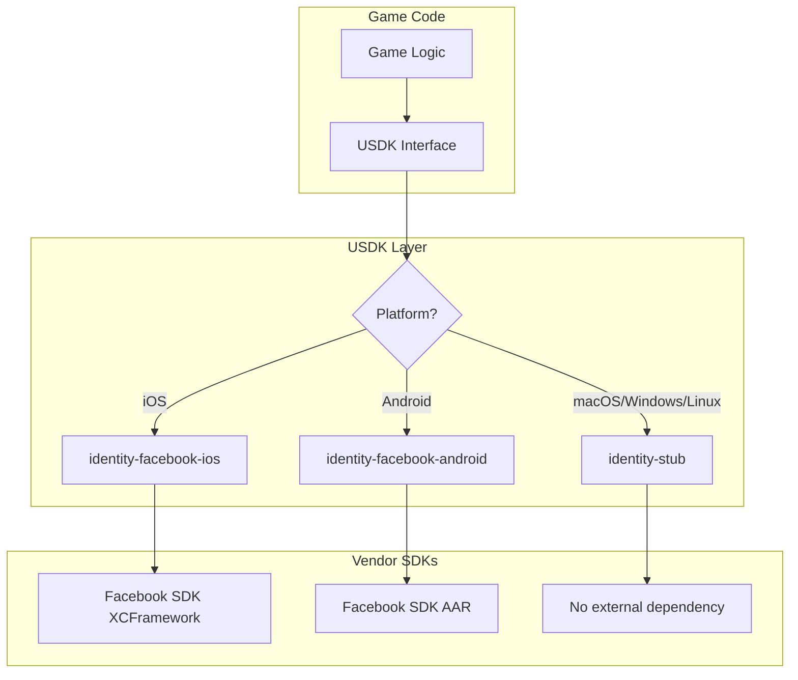

**Scaling iOS Modules with Bazel: rules_swift, Platform Patterns, and Cross-Platform CI**

I build the infrastructure layer that lets iOS engineers ship—Bazel-native XCFramework pipelines, cross-platform SDK modules, and CI build graphs—at the scale of a 300M+ MAU game. This guide distills the patterns I've developed for XCFramework integration, platform-conditional compilation, and CI strategies for large-scale gaming projects.

Modern mobile games ship on iOS, Android, macOS, Windows, and web—often from a single codebase. When third-party SDKs only support a subset of platforms (like iOS-only Facebook SDK), you need sophisticated build patterns to maintain a unified dependency graph.

---

## Background

### The Multi-Platform Challenge

Gaming applications face a unique build challenge: they need to compile native code for 6+ platforms while integrating vendor SDKs that often support only one or two. A typical dependency matrix looks like:

| SDK | iOS | macOS | Android | Windows | Linux | Web |
|-----|:---:|:-----:|:-------:|:-------:|:-----:|:---:|
| Facebook Login | ✓ | ✗ | ✓ | ✗ | ✗ | ✗ |
| Firebase Analytics | ✓ | ✓ | ✓ | ✗ | ✗ | ✗ |
| Apple Game Center | ✓ | ✓ | ✗ | ✗ | ✗ | ✗ |
| Steam SDK | ✗ | ✓ | ✗ | ✓ | ✓ | ✗ |

Without careful architecture, you end up with:
- Platform-specific `#ifdef` sprawl throughout the codebase
- Duplicate BUILD files per platform
- CI jobs that can't share build graphs
- Broken builds when someone adds a dependency without checking all platforms

### What Are XCFrameworks?

XCFrameworks (`.xcframework`) are Apple's modern binary distribution format, replacing fat/universal binaries. They bundle multiple architecture slices in a structured directory:

```
FacebookSDK.xcframework/
├── Info.plist
├── ios-arm64/
│   └── FacebookSDK.framework/
├── ios-arm64_x86_64-simulator/
│   └── FacebookSDK.framework/
└── macos-arm64_x86_64/          # Often missing!
    └── FacebookSDK.framework/
```

**Key insight:** Many vendor XCFrameworks ship iOS slices but omit macOS. This becomes a build-time landmine when your unified codebase tries to link them on macOS.

---

## Why We Do This

### The Unified SDK Pattern

Large game studios often build a **Unified SDK (USDK)** layer—a cross-platform abstraction over vendor-specific functionality:



### Goals

1. **Single BUILD target** for the USDK module (e.g., `//usdk:identity-facebook`)
2. **Automatic platform selection** via Bazel's `select()` mechanism
3. **Graceful degradation** on unsupported platforms (stub implementations)
4. **CI that validates all platforms** in a single build graph

---

## Architecture Deep Dive

### Module Structure

A well-organized USDK module follows this directory layout:

```
usdk/modules/identity-facebook/
├── api/                          # Cross-platform public API
│   └── include/
│       └── identity_facebook.h
├── impl/
│   ├── apple/
│   │   └── ios/
│   │       └── source/
│   │           ├── FacebookIdentityProvider.h
│   │           └── FacebookIdentityProvider.mm   # Objective-C++
│   ├── android/
│   │   └── source/
│   │       └── FacebookIdentityProvider.java
│   └── default/
│       └── source/
│           └── StubIdentityProvider.cpp          # Fallback
└── factory/
    └── default/
        └── include/
            └── Create.h                           # Factory function
```

### The Platform Selection Problem

Consider this naive approach:

```python
# DON'T DO THIS - breaks on macOS
cc_library(
    name = "identity-facebook",
    deps = [
        "@facebook_sdk//:core",  # XCFramework with no macOS slice
    ],
)
```

Building on macOS fails:
```
error: no matching architecture in '@facebook_sdk//:core'
```

---

## Solution: Platform-Conditional Dependencies

### Pattern 1: Using `select()` for Platform Deps

```python
usdk_module(
    name = "identity-facebook",
    api_hdrs = glob(["modules/identity-facebook/api/include/**/*.h"]),
    platform_deps = select({
        "@platforms//os:ios": [":identity-facebook-ios-objc"],
        "@platforms//os:android": [":identity-facebook-android"],
        "//conditions:default": [],  # Stub on other platforms
    }),
    default_srcs = glob(["modules/identity-facebook/impl/default/source/*.cpp"]),
)
```

### Pattern 2: Separate `objc_library` for iOS-Only Code

When your iOS implementation requires Objective-C++ (`.mm` files) and iOS-only frameworks:

```python
objc_library(
    name = "identity-facebook-ios-objc",
    srcs = glob(["modules/identity-facebook/impl/apple/ios/source/*.mm"]),
    hdrs = glob([
        "modules/identity-facebook/impl/apple/ios/source/*.h",
        "modules/identity-facebook/impl/shared/*.h",
        "modules/identity-facebook/factory/default/include/**/*.h",
    ]),
    copts = ["-fmodules"],
    sdk_frameworks = [
        "AuthenticationServices",
        "SafariServices",
    ],
    deps = [
        "@facebook_sdk//:FBSDKCoreKit",
        "@facebook_sdk//:FBSDKLoginKit",
    ],
    target_compatible_with = select({
        "@platforms//os:ios": [],
        "//conditions:default": ["@platforms//:incompatible"],
    }),
)
```

**Critical:** The `target_compatible_with` attribute ensures this target is **marked incompatible** on non-iOS platforms, preventing Bazel from even attempting to analyze it.

### Pattern 3: Why Not `create_objc = True`?

Some build systems offer convenience flags like `create_objc = True` that auto-generate objc_library targets. This fails for iOS-only SDKs because:

```python
# This adds objc_library to BOTH iOS and macOS
usdk_module(
    name = "identity-facebook",
    create_objc = True,  # Creates objc lib for iOS AND macOS
    objc_deps = ["@facebook_sdk//:core"],  # No macOS slice!
)
```

```
# macOS build fails:
ERROR: missing architecture slice for macos-arm64 in FacebookSDK.xcframework
```

**Solution:** Use explicit `objc_library` with `target_compatible_with` restricted to iOS only.

---

## XCFramework Integration with Bazel

### Importing XCFrameworks via `apple_static_xcframework_import`

```python
load("@rules_apple//apple:apple.bzl", "apple_static_xcframework_import")

apple_static_xcframework_import(
    name = "FBSDKCoreKit",
    xcframework = "xcframeworks/FBSDKCoreKit.xcframework",
    visibility = ["//visibility:public"],
)

apple_static_xcframework_import(
    name = "FBSDKLoginKit",
    xcframework = "xcframeworks/FBSDKLoginKit.xcframework",
    deps = [":FBSDKCoreKit"],
    visibility = ["//visibility:public"],
)
```

### Dynamic vs Static XCFrameworks

| Type | Use Case | Bazel Rule |
|------|----------|------------|
| Static | Embedded in app binary | `apple_static_xcframework_import` |
| Dynamic | Bundled in app's Frameworks/ | `apple_dynamic_xcframework_import` |

For gaming applications, **static linking** is typically preferred to avoid runtime framework loading overhead.

---

## Platform Patterns Reference

### The `target_compatible_with` Pattern

This is the most powerful pattern for platform-specific code:

```python
cc_library(
    name = "metal-renderer",
    srcs = ["metal_renderer.mm"],
    target_compatible_with = select({
        "@platforms//os:ios": [],
        "@platforms//os:macos": [],
        "//conditions:default": ["@platforms//:incompatible"],
    }),
)
```

**How it works:**
- On iOS/macOS: empty constraint list = compatible
- On other platforms: `@platforms//:incompatible` = skip this target entirely

### The `select()` Pattern for Dependencies

```python
cc_library(
    name = "graphics-backend",
    deps = select({
        "@platforms//os:ios": [":metal-renderer"],
        "@platforms//os:macos": [":metal-renderer"],
        "@platforms//os:android": [":vulkan-renderer"],
        "@platforms//os:windows": [":directx-renderer", ":vulkan-renderer"],
        "@platforms//os:linux": [":vulkan-renderer"],
        "//conditions:default": [":software-renderer"],
    }),
)
```

### Combining Patterns

For complex scenarios, combine both patterns:

```python
# iOS-only objc code
objc_library(
    name = "ios-impl",
    srcs = ["ios_impl.mm"],
    deps = ["@vendor_ios_sdk//:core"],
    target_compatible_with = select({
        "@platforms//os:ios": [],
        "//conditions:default": ["@platforms//:incompatible"],
    }),
)

# Cross-platform module with platform-specific deps
cc_library(
    name = "my-module",
    srcs = ["common.cpp"],
    deps = [":my-module-api"] + select({
        "@platforms//os:ios": [":ios-impl"],
        "@platforms//os:android": [":android-impl"],
        "//conditions:default": [":stub-impl"],
    }),
)
```

---

## Cross-Platform CI Strategy

### Build Matrix

A robust CI pipeline tests all platform combinations:

```yaml
# .github/workflows/build.yml (conceptual)
jobs:
  build:
    strategy:
      matrix:
        platform:
          - ios-sim
          - ios-device
          - macos
          - android
          - linux
          - windows
    steps:
      - run: bazel build //:app --config=${{ matrix.platform }}
```

### Platform Configurations

Define platform configs in `.bazelrc`:

```bash
# iOS Simulator (arm64 for Apple Silicon Macs)
build:ios-sim --platforms=//platforms:ios_sim_arm64

# iOS Device
build:ios-device --platforms=//platforms:ios_arm64

# macOS (native)
build:macos --platforms=//platforms:macos

# Android (arm64-v8a)
build:android --platforms=//platforms:android_arm64

# Linux (host)
build:linux --platforms=@local_config_platform//:host
```

### Catching Platform-Specific Failures Early

Use Bazel's `cquery` to validate dependencies before full builds:

```bash
# Check if identity-facebook resolves correctly on each platform
for platform in ios-sim macos android linux; do
  echo "=== Checking $platform ==="
  bazel cquery 'deps(//usdk:identity-facebook)' --config=$platform 2>&1 | grep -i error && exit 1
done
```

---

## Common Pitfalls and Solutions

### Pitfall 1: Missing Architecture Slices

**Symptom:**
```
error: no matching architecture in 'FacebookSDK.xcframework' for macos-arm64
```

**Solution:** Use `target_compatible_with` to exclude the target on unsupported platforms.

### Pitfall 2: Duplicate Symbols

**Symptom:**
```
duplicate symbol '_FBSDKSettings' in:
    FBSDKCoreKit.framework/FBSDKCoreKit
    FBSDKLoginKit.framework/FBSDKLoginKit
```

**Solution:** Ensure XCFramework imports have proper `deps` relationships:

```python
apple_static_xcframework_import(
    name = "FBSDKLoginKit",
    xcframework = "FBSDKLoginKit.xcframework",
    deps = [":FBSDKCoreKit"],  # Prevents duplicate linking
)
```

### Pitfall 3: Objective-C Modules Not Found

**Symptom:**
```
fatal error: module 'FBSDKCoreKit' not found
```

**Solution:** Add `-fmodules` to copts and ensure framework search paths are correct:

```python
objc_library(
    name = "my-ios-impl",
    copts = [
        "-fmodules",
        "-fmodules-cache-path=$(GENDIR)/modules-cache",
    ],
)
```

### Pitfall 4: Mixing `impl/default` with Platform-Specific Impls

**Symptom:** Headers from default/stub implementation leak into iOS implementation, causing redefinition errors.

**Solution:** Keep `hdrs` globs mutually exclusive:

```python
# WRONG - both will be included
hdrs = glob([
    "modules/my-module/impl/default/source/*.h",     # Stub headers
    "modules/my-module/impl/apple/ios/source/*.h",   # iOS headers
])

# RIGHT - only iOS headers for iOS target
hdrs = glob([
    "modules/my-module/impl/apple/ios/source/*.h",
    "modules/my-module/impl/shared/*.h",  # Shared utilities OK
    "modules/my-module/factory/default/include/**/*.h",  # Factory OK
])
```

---

## Advanced: Creating Your Own XCFrameworks

For internal libraries that need to ship as XCFrameworks:

```python
load("@rules_apple//apple:apple.bzl", "apple_static_xcframework")

apple_static_xcframework(
    name = "MyGameSDK",
    bundle_name = "MyGameSDK",
    ios = {
        "simulator": ["arm64", "x86_64"],
        "device": ["arm64"],
    },
    macos = {
        "device": ["arm64", "x86_64"],
    },
    minimum_os_versions = {
        "ios": "14.0",
        "macos": "11.0",
    },
    deps = [":my-game-sdk-impl"],
)
```

This generates a universal `.xcframework` that works on:
- iOS Simulator (arm64, x86_64)
- iOS Device (arm64)
- macOS (arm64, x86_64)

---

## Summary

Building iOS modules with XCFrameworks in a cross-platform gaming codebase requires:

1. **Platform-conditional dependencies** via `select()` statements
2. **Explicit incompatibility markers** via `target_compatible_with`
3. **Separate `objc_library` targets** for iOS-only Objective-C++ code
4. **Proper XCFramework imports** with correct dependency chains
5. **CI that validates all platforms** before merge

The key insight is that `target_compatible_with = ["@platforms//:incompatible"]` tells Bazel to **skip** a target entirely on unsupported platforms, rather than failing with missing dependencies.

---

## References

- [rules_apple Documentation](https://github.com/bazelbuild/rules_apple)
- [rules_swift Documentation](https://github.com/bazelbuild/rules_swift)
- [Apple XCFramework Documentation](https://developer.apple.com/documentation/xcode/creating-a-multi-platform-binary-framework-bundle)
- [Bazel Platform Documentation](https://bazel.build/concepts/platforms)
- [Bazel select() Reference](https://bazel.build/reference/be/functions#select)
