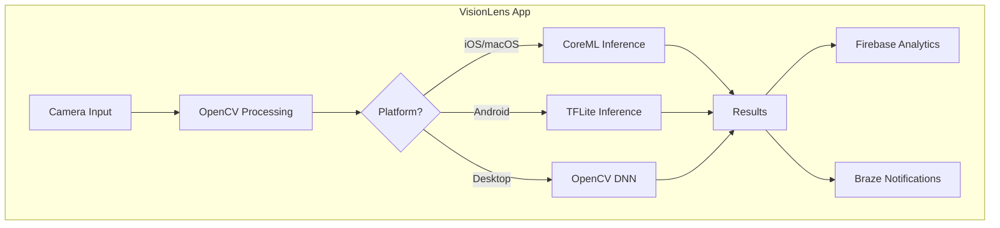

# Building AI-Powered iOS Applications with XCFrameworks and Bazel

**Integrating OpenCV, CoreML, and Vendor SDKs for Cross-Platform Computer Vision Apps**

Picture this: You're building **VisionLens**—an AI-powered camera app that uses OpenCV for real-time object detection, Apple's CoreML for on-device inference, Firebase Analytics for user insights, and Braze for intelligent push notifications. Users point their iPhone 17 camera at anything—a plant, a landmark, a product—and get instant AI-powered recognition with contextual notifications.

The challenge? OpenCV is a massive C++ library. CoreML is Apple-only. Firebase and Braze have iOS-specific XCFrameworks. And you need this to compile for iOS, macOS, Android, and desktop—from a single codebase.

This guide shows you how to architect, package, and build such applications using Bazel, XCFrameworks, and modern Swift/C++ interoperability patterns.

---

## The Vision: AI Camera App Architecture

### What We're Building

**VisionLens** combines multiple technologies:

| Component | Technology | Platform Support |
|-----------|------------|------------------|
| Camera Pipeline | AVFoundation + OpenCV | iOS, macOS |
| Object Detection | OpenCV DNN / YOLO | All platforms |
| On-Device ML | CoreML + Vision.framework | iOS, macOS |
| Analytics | Firebase Analytics | iOS, Android |
| Push Notifications | Braze SDK | iOS, Android |
| Social Sharing | Facebook SDK | iOS, Android |

### The Multi-Platform Reality



---

## OpenCV Integration: The Foundation

### Why OpenCV with XCFramework?

OpenCV is traditionally distributed as source or prebuilt binaries. For iOS, packaging it as an XCFramework provides:

- **Single import** for simulator + device architectures
- **Bitcode support** (when needed)
- **Clean Bazel integration** via `apple_static_xcframework_import`

### Building OpenCV XCFramework

First, build OpenCV as an XCFramework (one-time setup):

```bash
# Clone OpenCV
git clone https://github.com/opencv/opencv.git
cd opencv

# Build iOS framework
python platforms/apple/build_xcframework.py \
    --out ./build_xcframework \
    --iphoneos_archs arm64 \
    --iphonesimulator_archs arm64,x86_64 \
    --build_only_specified_archs \
    --without objc \
    --disable-bitcode
```

This produces `opencv2.xcframework` with slices for:
- `ios-arm64` (device)
- `ios-arm64_x86_64-simulator` (simulator)

### Importing OpenCV in Bazel

```python
# bz-tools/prebuild/prebuild_deps.bzl

http_archive(
    name = "opencv_xcframework",
    url = "https://artifactory.example.com/opencv/4.9.0/opencv2.xcframework.zip",
    sha256 = "a1b2c3d4e5f6...",  # Calculate after upload
    build_file_content = """
load("@rules_apple//apple:apple.bzl", "apple_static_xcframework_import")

apple_static_xcframework_import(
    name = "opencv2",
    xcframework_imports = glob(["opencv2.xcframework/**"]),
    visibility = ["//visibility:public"],
)
""",
)
```

### OpenCV C++ Wrapper for Swift Interop

OpenCV is pure C++. To use it from Swift, create an Objective-C++ bridge:

```cpp
// VisionProcessor.h
#pragma once
#import <Foundation/Foundation.h>
#import <CoreVideo/CoreVideo.h>

NS_ASSUME_NONNULL_BEGIN

@interface VisionProcessor : NSObject

- (instancetype)initWithModelPath:(NSString *)modelPath;
- (NSArray<NSDictionary *> *)detectObjectsInPixelBuffer:(CVPixelBufferRef)pixelBuffer;
- (NSArray<NSDictionary *> *)detectObjectsInImageData:(NSData *)imageData
                                                width:(int)width
                                               height:(int)height;

@end

NS_ASSUME_NONNULL_END
```

```objc
// VisionProcessor.mm
#import "VisionProcessor.h"
#import <opencv2/opencv.hpp>
#import <opencv2/dnn.hpp>
#import <opencv2/imgproc.hpp>

@implementation VisionProcessor {
    cv::dnn::Net _net;
    std::vector<std::string> _classNames;
}

- (instancetype)initWithModelPath:(NSString *)modelPath {
    self = [super init];
    if (self) {
        // Load YOLO or other DNN model
        std::string cfgPath = std::string([modelPath UTF8String]) + "/yolov8.cfg";
        std::string weightsPath = std::string([modelPath UTF8String]) + "/yolov8.weights";

        _net = cv::dnn::readNetFromDarknet(cfgPath, weightsPath);
        _net.setPreferableBackend(cv::dnn::DNN_BACKEND_OPENCV);
        _net.setPreferableTarget(cv::dnn::DNN_TARGET_CPU);
    }
    return self;
}

- (NSArray<NSDictionary *> *)detectObjectsInPixelBuffer:(CVPixelBufferRef)pixelBuffer {
    CVPixelBufferLockBaseAddress(pixelBuffer, kCVPixelBufferLock_ReadOnly);

    void *baseAddress = CVPixelBufferGetBaseAddress(pixelBuffer);
    size_t width = CVPixelBufferGetWidth(pixelBuffer);
    size_t height = CVPixelBufferGetHeight(pixelBuffer);
    size_t bytesPerRow = CVPixelBufferGetBytesPerRow(pixelBuffer);

    // Convert to cv::Mat
    cv::Mat frame(static_cast<int>(height), static_cast<int>(width),
                  CV_8UC4, baseAddress, bytesPerRow);
    cv::Mat rgb;
    cv::cvtColor(frame, rgb, cv::COLOR_BGRA2RGB);

    CVPixelBufferUnlockBaseAddress(pixelBuffer, kCVPixelBufferLock_ReadOnly);

    return [self runInference:rgb];
}

- (NSArray<NSDictionary *> *)runInference:(cv::Mat &)image {
    cv::Mat blob = cv::dnn::blobFromImage(image, 1/255.0, cv::Size(640, 640),
                                           cv::Scalar(), true, false);
    _net.setInput(blob);

    std::vector<cv::Mat> outputs;
    _net.forward(outputs, _net.getUnconnectedOutLayersNames());

    NSMutableArray *results = [NSMutableArray array];
    // Process detections...

    return results;
}

@end
```

---

## CoreML Integration: Apple's Neural Engine

### Combining OpenCV with CoreML

For maximum performance on Apple devices, use CoreML for inference while OpenCV handles preprocessing:

```swift
// VisionLensProcessor.swift
import CoreML
import Vision
import CoreVideo

@objc public class VisionLensProcessor: NSObject {
    private let mlModel: VNCoreMLModel
    private let opencvProcessor: VisionProcessor

    @objc public init(modelURL: URL, opencvModelPath: String) throws {
        let config = MLModelConfiguration()
        config.computeUnits = .all  // Use Neural Engine when available

        let model = try MLModel(contentsOf: modelURL, configuration: config)
        self.mlModel = try VNCoreMLModel(for: model)
        self.opencvProcessor = VisionProcessor(modelPath: opencvModelPath)

        super.init()
    }

    @objc public func processFrame(_ pixelBuffer: CVPixelBuffer,
                                    useNeuralEngine: Bool) -> [[String: Any]] {
        if useNeuralEngine {
            return processwithCoreML(pixelBuffer)
        } else {
            // Fallback to OpenCV DNN (useful for unsupported models)
            return opencvProcessor.detectObjects(in: pixelBuffer) as? [[String: Any]] ?? []
        }
    }

    private func processwithCoreML(_ pixelBuffer: CVPixelBuffer) -> [[String: Any]] {
        let request = VNCoreMLRequest(model: mlModel) { request, error in
            // Handle results
        }
        request.imageCropAndScaleOption = .scaleFill

        let handler = VNImageRequestHandler(cvPixelBuffer: pixelBuffer, options: [:])
        try? handler.perform([request])

        // Convert VNRecognizedObjectObservation to dictionary
        return []
    }
}
```

### BUILD.bazel for Vision Module

```python
load("@rules_swift//swift:swift.bzl", "swift_library")
load("@rules_apple//apple:apple.bzl", "apple_static_xcframework_import")

# OpenCV XCFramework
apple_static_xcframework_import(
    name = "opencv2",
    xcframework_imports = glob(["opencv2.xcframework/**"]),
    visibility = ["//visibility:public"],
)

# Objective-C++ bridge for OpenCV
objc_library(
    name = "vision-processor-objc",
    srcs = ["source/VisionProcessor.mm"],
    hdrs = ["source/VisionProcessor.h"],
    copts = [
        "-std=c++17",
        "-fmodules",
    ],
    sdk_frameworks = [
        "CoreVideo",
        "Accelerate",
    ],
    deps = [
        "@opencv_xcframework//:opencv2",
    ],
    target_compatible_with = select({
        "@platforms//os:ios": [],
        "@platforms//os:macos": [],
        "//conditions:default": ["@platforms//:incompatible"],
    }),
)

# Swift library with CoreML + OpenCV integration
swift_library(
    name = "vision-lens-swift",
    srcs = glob(["source/*.swift"]),
    module_name = "VisionLens",
    generates_header = True,
    generated_header_name = "VisionLens-Swift.h",
    copts = [
        "-cxx-interoperability-mode=default",
    ],
    deps = [
        ":vision-processor-objc",
    ],
    target_compatible_with = select({
        "@platforms//os:ios": [],
        "@platforms//os:macos": [],
        "//conditions:default": ["@platforms//:incompatible"],
    }),
)
```

---

## Adding Analytics: Firebase Integration

### Why Firebase Analytics?

Track how users interact with your AI features:
- Which objects are detected most frequently
- Camera session duration
- Model inference latency
- Feature adoption rates

### Firebase XCFrameworks Setup

Firebase requires **10 interconnected XCFrameworks**:

```python
# bz-tools/prebuild/prebuild_deps.bzl

FIREBASE_VERSION = "11.6.0"
FIREBASE_BASE_URL = "https://artifactory.example.com/firebase-ios"

# Core frameworks
http_archive(
    name = "firebase_FirebaseCore",
    url = f"{FIREBASE_BASE_URL}/{FIREBASE_VERSION}/FirebaseCore.xcframework.zip",
    sha256 = "abc123...",
    build_file_content = """
load("@rules_apple//apple:apple.bzl", "apple_static_xcframework_import")
apple_static_xcframework_import(
    name = "FirebaseCore",
    xcframework_imports = glob(["FirebaseCore.xcframework/**"]),
    visibility = ["//visibility:public"],
)
""",
)

http_archive(
    name = "firebase_FirebaseAnalytics",
    url = f"{FIREBASE_BASE_URL}/{FIREBASE_VERSION}/FirebaseAnalytics.xcframework.zip",
    sha256 = "def456...",
    build_file_content = """
load("@rules_apple//apple:apple.bzl", "apple_static_xcframework_import")
apple_static_xcframework_import(
    name = "FirebaseAnalytics",
    xcframework_imports = glob(["FirebaseAnalytics.xcframework/**"]),
    deps = [
        "@firebase_FirebaseCore//:FirebaseCore",
        "@firebase_GoogleAppMeasurement//:GoogleAppMeasurement",
    ],
    visibility = ["//visibility:public"],
)
""",
)

# Supporting frameworks
http_archive(name = "firebase_GoogleAppMeasurement", ...)
http_archive(name = "firebase_GoogleAppMeasurementIdentitySupport", ...)
http_archive(name = "firebase_GoogleUtilities", ...)
http_archive(name = "firebase_FBLPromises", ...)
http_archive(name = "firebase_nanopb", ...)
http_archive(name = "firebase_FirebaseCoreInternal", ...)
http_archive(name = "firebase_FirebaseInstallations", ...)
http_archive(name = "firebase_GoogleAdsOnDeviceConversion", ...)
```

### Firebase Analytics USDK Module

```python
# usdk/modules/firebase-analytics/impl/apple/ios/BUILD.bazel

objc_library(
    name = "firebase-analytics-ios-objc",
    srcs = glob(["source/*.mm"]),
    hdrs = glob(["source/*.h"]),
    copts = ["-fmodules"],
    sdk_frameworks = [
        "Foundation",
        "StoreKit",
        "SystemConfiguration",
    ],
    deps = [
        "@firebase_FirebaseAnalytics//:FirebaseAnalytics",
        "@firebase_FirebaseCore//:FirebaseCore",
        "@firebase_GoogleAppMeasurement//:GoogleAppMeasurement",
        "@firebase_GoogleUtilities//:GoogleUtilities",
        "@firebase_FBLPromises//:FBLPromises",
        "@firebase_nanopb//:nanopb",
    ],
    target_compatible_with = select({
        "@platforms//os:ios": [],
        "//conditions:default": ["@platforms//:incompatible"],
    }),
)
```

### Tracking AI Events

```swift
// AnalyticsTracker.swift
import Foundation

@objc public class AnalyticsTracker: NSObject {

    @objc public static func trackObjectDetection(
        objectClass: String,
        confidence: Float,
        inferenceTimeMs: Double,
        modelType: String  // "coreml" or "opencv"
    ) {
        // Calls into Firebase Analytics via ObjC++ bridge
        FirebaseAnalyticsBridge.logEvent(
            "object_detected",
            parameters: [
                "object_class": objectClass,
                "confidence": confidence,
                "inference_time_ms": inferenceTimeMs,
                "model_type": modelType,
                "device_model": UIDevice.current.model
            ]
        )
    }

    @objc public static func trackCameraSession(
        durationSeconds: Int,
        framesProcessed: Int,
        objectsDetected: Int
    ) {
        FirebaseAnalyticsBridge.logEvent(
            "camera_session",
            parameters: [
                "duration_seconds": durationSeconds,
                "frames_processed": framesProcessed,
                "objects_detected": objectsDetected,
                "avg_fps": Float(framesProcessed) / Float(durationSeconds)
            ]
        )
    }
}
```

---

## Smart Notifications: Braze Integration

### Contextual AI-Powered Notifications

Use Braze to send intelligent notifications based on detected objects:

- "You looked at 5 plants today! Check out our plant care guide."
- "Detected a rare bird species? Share your sighting with the community!"
- "Your AI assistant identified 3 landmarks. Unlock the history feature!"

### Braze XCFrameworks Setup

```python
# bz-tools/prebuild/prebuild_deps.bzl

BRAZE_VERSION = "10.3.1"
BRAZE_BASE_URL = "https://artifactory.example.com/braze-swift-ios"

http_archive(
    name = "braze_BrazeKit",
    url = f"{BRAZE_BASE_URL}/{BRAZE_VERSION}/BrazeKit.xcframework.zip",
    sha256 = "00ea5ef282565ebaeace36718c7e30736c4cd1dde520925525afa1c0913fbe21",
    build_file_content = """
load("@rules_apple//apple:apple.bzl", "apple_static_xcframework_import")
apple_static_xcframework_import(
    name = "BrazeKit",
    xcframework_imports = glob(["BrazeKit.xcframework/**"]),
    visibility = ["//visibility:public"],
)
""",
)

http_archive(
    name = "braze_BrazeUI",
    url = f"{BRAZE_BASE_URL}/{BRAZE_VERSION}/BrazeUI.xcframework.zip",
    sha256 = "57444acc909fe1a498106a924bf9dcde1c4523fcd5908807280b9535c48e50d5",
    build_file_content = """
load("@rules_apple//apple:apple.bzl", "apple_static_xcframework_import")
apple_static_xcframework_import(
    name = "BrazeUI",
    xcframework_imports = glob(["BrazeUI.xcframework/**"]),
    deps = ["@braze_BrazeKit//:BrazeKit"],
    visibility = ["//visibility:public"],
)
""",
)

http_archive(
    name = "braze_SDWebImage",
    url = f"{BRAZE_BASE_URL}/{BRAZE_VERSION}/SDWebImage.xcframework.zip",
    sha256 = "707ae5f0cf2dd6fc1aae9c6beaa7224fc153f575dc3daa3a2d6c23c2d30448c3",
    build_file_content = """
load("@rules_apple//apple:apple.bzl", "apple_static_xcframework_import")
apple_static_xcframework_import(
    name = "SDWebImage",
    xcframework_imports = glob(["SDWebImage.xcframework/**"]),
    visibility = ["//visibility:public"],
)
""",
)
```

### Braze Swift + ObjC++ Module

```python
# usdk/modules/promotions-braze/impl/apple/ios/BUILD.bazel

load("@rules_swift//swift:swift.bzl", "swift_library")

swift_library(
    name = "promotions-braze-swift",
    srcs = glob(["source/*.swift"]),
    module_name = "usdk_promotions_braze",
    generates_header = True,
    generated_header_name = "usdk_promotions_braze-Swift.h",
    copts = [
        "-cxx-interoperability-mode=default",
        "-import-objc-header",
        "$(location source/usdk-promotions-braze-Bridging-Header.h)",
    ],
    srcs = ["source/usdk-promotions-braze-Bridging-Header.h"] + glob(["source/*.swift"]),
    deps = [
        "@braze_BrazeKit//:BrazeKit",
        "@braze_BrazeUI//:BrazeUI",
    ],
    target_compatible_with = select({
        "@platforms//os:ios": [],
        "//conditions:default": ["@platforms//:incompatible"],
    }),
)

# Expose Swift header for ObjC++ consumption
genrule(
    name = "promotions-braze-swift-header",
    srcs = [":promotions-braze-swift"],
    outs = ["usdk_promotions_braze-Swift.h"],
    cmd = "cp $(RULEDIR)/_objs/promotions-braze-swift/usdk_promotions_braze-Swift.h $@",
)

cc_library(
    name = "promotions-braze-swift-header-lib",
    hdrs = [":promotions-braze-swift-header"],
    includes = ["."],
)

objc_library(
    name = "promotions-braze-ios-objc",
    srcs = glob(["source/*.mm", "source/*.cpp"]),
    hdrs = glob(["source/*.h"]),
    copts = ["-fmodules", "-fcxx-modules"],
    sdk_frameworks = ["UIKit", "UserNotifications"],
    deps = [
        ":promotions-braze-swift",
        ":promotions-braze-swift-header-lib",
        "//usdk:promotions-braze-shared-headers",
        "@braze_BrazeKit//:BrazeKit",
        "@braze_BrazeUI//:BrazeUI",
        "@braze_SDWebImage//:SDWebImage",
    ],
    target_compatible_with = select({
        "@platforms//os:ios": [],
        "//conditions:default": ["@platforms//:incompatible"],
    }),
)
```

### Simulator Runtime Guards

Push notifications don't work on iOS Simulator. Guard appropriately:

```cpp
// PushNotificationManager.mm
#include <TargetConditionals.h>

void PushNotificationManager::Initialize() {
#if defined(__APPLE__) && TARGET_OS_SIMULATOR
    LOG_INFO("Push notifications disabled on simulator");
    return;
#endif

    if (IsPushSupported()) {
        RegisterForPushNotifications();
    }
}
```

```swift
// BrazeManager.swift
class BrazeManager {
    func initializePush() {
        #if targetEnvironment(simulator)
        print("Push notifications not available on simulator")
        return
        #endif

        Braze.notifications.register()
    }
}
```

---

## Unified SDK Module Pattern

### The Complete USDK Architecture

```python
# usdk/BUILD.bazel

load("//bz-tools/rules:usdk.bzl", "usdk_module")

# Vision processing module (OpenCV + CoreML)
usdk_module(
    name = "vision-processor",
    api_hdrs = glob(["modules/vision-processor/api/include/**/*.h"]),
    srcs = get_usdk_module_srcs(
        "modules/vision-processor",
        platform_exclude = {"ios": True, "macos": True},
    ),
    platform_deps = {
        "ios": ["//usdk/modules/vision-processor/impl/apple:vision-processor-apple"],
        "macos": ["//usdk/modules/vision-processor/impl/apple:vision-processor-apple"],
    },
)

# Firebase Analytics
usdk_module(
    name = "firebase-analytics",
    api_hdrs = glob(["modules/firebase-analytics/api/include/**/*.h"]),
    srcs = get_usdk_module_srcs(
        "modules/firebase-analytics",
        platform_exclude = {"ios": True},
    ),
    platform_deps = {
        "ios": ["//usdk/modules/firebase-analytics/impl/apple/ios:firebase-analytics-ios-objc"],
    },
)

# Braze Promotions
usdk_module(
    name = "promotions-braze",
    api_hdrs = glob(["modules/promotions-braze/api/include/**/*.h"]),
    srcs = get_usdk_module_srcs(
        "modules/promotions-braze",
        platform_exclude = {"ios": True},
    ),
    platform_deps = {
        "ios": ["//usdk/modules/promotions-braze/impl/apple/ios:promotions-braze-ios-objc"],
    },
    deps = [":promotions-braze-shared-headers"],
)

# Shared headers for cross-platform code
cc_library(
    name = "promotions-braze-shared-headers",
    hdrs = glob(["modules/promotions-braze/impl/shared/**/*.h"]),
    includes = ["modules/promotions-braze/impl/shared"],
    visibility = ["//visibility:public"],
)
```

---

## MODULE.bazel: Complete Repository Setup

```python
# MODULE.bazel

module(
    name = "visionlens",
    repo_name = "visionlens",
)

bazel_dep(name = "rules_apple", version = "4.3.3")
bazel_dep(name = "rules_swift", version = "2.8.2")
bazel_dep(name = "platforms", version = "1.0.0")

# XCFramework dependencies
prebuild_deps = use_extension("//bz-tools/prebuild:prebuild_deps.bzl", "prebuild_deps")
use_repo(
    prebuild_deps,
    # OpenCV
    "opencv_xcframework",

    # Braze SDK (3 frameworks)
    "braze_BrazeKit",
    "braze_BrazeUI",
    "braze_SDWebImage",

    # Firebase Analytics (10 frameworks)
    "firebase_FirebaseAnalytics",
    "firebase_FirebaseCore",
    "firebase_FirebaseCoreInternal",
    "firebase_FirebaseInstallations",
    "firebase_GoogleAppMeasurement",
    "firebase_GoogleAppMeasurementIdentitySupport",
    "firebase_GoogleUtilities",
    "firebase_GoogleAdsOnDeviceConversion",
    "firebase_FBLPromises",
    "firebase_nanopb",

    # Facebook SDK (6 frameworks)
    "facebook_FBSDKCoreKit",
    "facebook_FBSDKCoreKit_Basics",
    "facebook_FBAEMKit",
    "facebook_FBSDKLoginKit",
    "facebook_FBSDKShareKit",
    "facebook_FBSDKGamingServicesKit",
)
```

---

## Cross-Platform CI Strategy

### Build Matrix

```yaml
# .github/workflows/build.yml
jobs:
  build:
    strategy:
      matrix:
        include:
          - platform: ios-sim
            os: macos-14
          - platform: ios-device
            os: macos-14
          - platform: macos
            os: macos-14
          - platform: android
            os: ubuntu-latest
          - platform: linux
            os: ubuntu-latest
    runs-on: ${{ matrix.os }}
    steps:
      - uses: actions/checkout@v4
      - run: bazel build //:visionlens_app --config=${{ matrix.platform }}
```

### Platform Configurations

```bash
# .bazelrc

# iOS Simulator (Apple Silicon)
build:ios-sim --platforms=//platforms:ios_sim_arm64
build:ios-sim --ios_simulator_device="iPhone 15 Pro"
build:ios-sim --ios_simulator_version="17.0"

# iOS Device
build:ios-device --platforms=//platforms:ios_arm64

# macOS
build:macos --platforms=//platforms:macos_arm64
```

---

## Common Pitfalls and Solutions

### Pitfall 1: OpenCV Linking Errors

**Symptom:**
```
Undefined symbols: cv::Mat::Mat()
```

**Solution:** Ensure OpenCV xcframework includes all required modules and link order is correct:

```python
deps = [
    "@opencv_xcframework//:opencv2",
],
linkopts = [
    "-lc++",
    "-framework Accelerate",
],
```

### Pitfall 2: Swift Header Not Found

**Symptom:**
```
fatal error: 'usdk_promotions_braze-Swift.h' file not found
```

**Solution:** Use genrule to copy Swift-generated header:

```python
genrule(
    name = "copy-swift-header",
    srcs = [":my-swift-lib"],
    outs = ["MyModule-Swift.h"],
    cmd = "cp $(RULEDIR)/_objs/my-swift-lib/MyModule-Swift.h $@",
)
```

### Pitfall 3: Missing XCFramework Architecture

**Symptom:**
```
error: no matching architecture in 'BrazeKit.xcframework' for macos-arm64
```

**Solution:** Use `target_compatible_with` to restrict to supported platforms:

```python
target_compatible_with = select({
    "@platforms//os:ios": [],
    "//conditions:default": ["@platforms//:incompatible"],
}),
```

### Pitfall 4: Firebase Framework Chain

**Symptom:**
```
Undefined symbol: _OBJC_CLASS_$_FIRApp
```

**Solution:** Firebase requires all 10 frameworks linked. Check deps chain:

```python
deps = [
    "@firebase_FirebaseAnalytics//:FirebaseAnalytics",
    "@firebase_FirebaseCore//:FirebaseCore",
    "@firebase_GoogleAppMeasurement//:GoogleAppMeasurement",
    # ... all 10 frameworks
],
```

### Pitfall 5: XCFramework Repo Not Visible

**Symptom:**
```
ERROR: no such package '@braze_BrazeKit//': Repository '@braze_BrazeKit' not visible
```

**Solution:** Add to BOTH `prebuild_deps.bzl` AND `MODULE.bazel use_repo`:

```python
# MODULE.bazel
use_repo(
    prebuild_deps,
    "braze_BrazeKit",  # Must be listed here!
)
```

---

## iOS Module Migration Checklist

When adding new iOS SDK modules:

1. **Identify XCFrameworks**: Check SDK documentation for required frameworks
2. **Calculate SHA256**: Download and hash each xcframework
   ```bash
   shasum -a 256 BrazeKit.xcframework.zip
   ```
3. **Add to prebuild_deps.bzl**: Define http_archive with build_file_content
4. **Add to MODULE.bazel**: Include in use_repo for visibility
5. **Create Swift library**: Use `generates_header` and `-cxx-interoperability-mode`
6. **Expose Swift headers**: Use genrule to copy to predictable location
7. **Create ObjC++ bridge**: Link Swift and C++ code
8. **Add platform guards**: `target_compatible_with` for platform restrictions
9. **Add simulator guards**: Runtime checks for hardware-dependent features
10. **Test all platforms**: Run CI matrix build

---

## Summary

Building AI-powered iOS applications with OpenCV, CoreML, and vendor SDKs requires:

1. **OpenCV as XCFramework** for clean Bazel integration
2. **ObjC++ bridges** between C++ (OpenCV) and Swift (iOS APIs)
3. **Swift/C++ interoperability** via `-cxx-interoperability-mode`
4. **Centralized XCFramework management** with sha256 verification
5. **Platform-conditional dependencies** via `select()` and `target_compatible_with`
6. **Simulator runtime guards** for APNs and hardware features
7. **Complete dependency chains** (Firebase needs 10 frameworks!)

The patterns in this guide enable you to build sophisticated computer vision applications that leverage the best of native Apple frameworks (CoreML, Vision, AVFoundation) alongside powerful cross-platform libraries (OpenCV) and essential vendor SDKs (Firebase, Braze, Facebook).

---

## References

- [OpenCV iOS Installation](https://docs.opencv.org/4.x/d5/da3/tutorial_ios_install.html)
- [Apple CoreML Documentation](https://developer.apple.com/documentation/coreml)
- [Apple Vision Framework](https://developer.apple.com/documentation/vision)
- [rules_apple Documentation](https://github.com/bazelbuild/rules_apple)
- [rules_swift Documentation](https://github.com/bazelbuild/rules_swift)
- [Swift C++ Interoperability](https://www.swift.org/documentation/cxx-interop/)
- [Braze Swift SDK](https://www.braze.com/docs/developer_guide/platform_integration_guides/swift/)
- [Firebase iOS Setup](https://firebase.google.com/docs/ios/setup)
- [Bazel Platforms](https://bazel.build/concepts/platforms)

---

*Published: March 2026*
